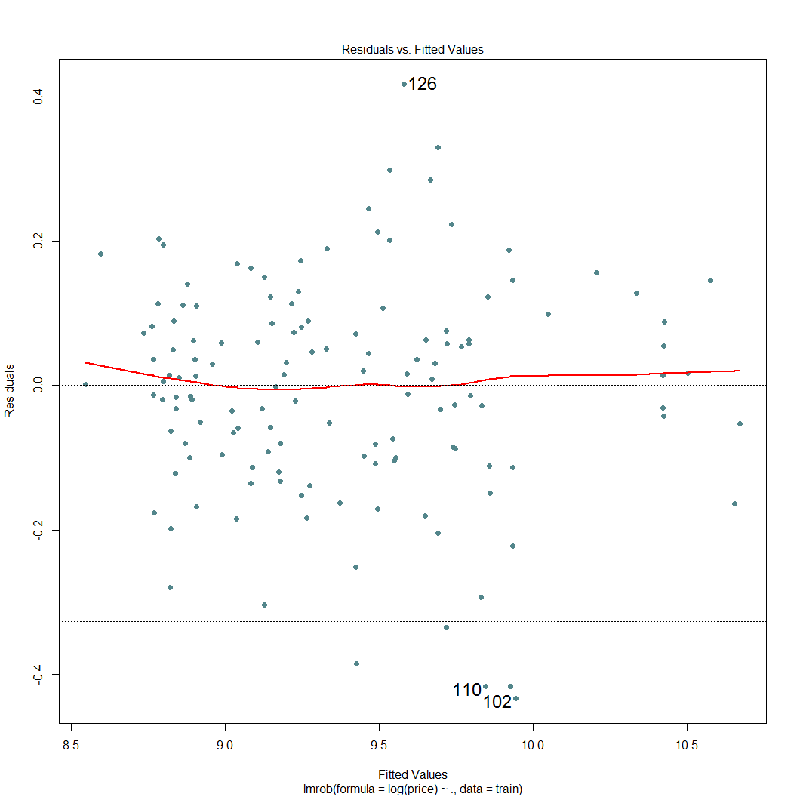

Car\_Price\_Pred
================
Brandon Wolff
June 17, 2017

Car Price Prediction
--------------------

``` r
price <- read.csv("car_data.csv")

price <- price[c(-1)]
```

Unsupervised Learning
---------------------

Principal Components Analysis
=============================

``` r
stopifnot(require(pcaPP))
```

    ## Loading required package: pcaPP

``` r
pca <- PCAproj(price, scale = sd)

pca$center
```

    ##  [1]   13.273385    1.915681    1.131000    2.380127    3.632148
    ##  [6]    2.209346    1.010359   97.773416  173.103617   65.514802
    ## [11]   53.545956 2439.712580    4.115011    3.185360  117.094819
    ## [16]    4.203272    9.968635   33.246526   13.306679   25.343409
    ## [21]   31.133851  100.607436

``` r
pca$loadings
```

    ## 
    ## Loadings:
    ##                   Comp.1 Comp.2
    ## make                     -0.280
    ## fuel_type                      
    ## aspiration         0.168       
    ## num_of_doors              0.560
    ## body_style               -0.407
    ## drive_wheels       0.235       
    ## engine_location                
    ## wheel_base         0.213 -0.227
    ## length             0.278 -0.228
    ## width              0.270 -0.106
    ## height                   -0.398
    ## curb_weight        0.316       
    ## engine_type                    
    ## num_of_cylinders               
    ## engine_size        0.233       
    ## fuel_system        0.397       
    ## compression_ratio              
    ## horsepower        -0.332 -0.210
    ## peak_rpm                  0.270
    ## city_mpg          -0.321       
    ## highway_mpg       -0.317       
    ## price             -0.296 -0.114
    ## 
    ##                Comp.1 Comp.2
    ## SS loadings     1.000  1.000
    ## Proportion Var  0.045  0.045
    ## Cumulative Var  0.045  0.091

``` r
colSums(pca$loadings^2)
```

    ## Comp.1 Comp.2 
    ##      1      1

``` r
summary(pca)
```

    ## Importance of components:
    ##                           Comp.1    Comp.2
    ## Standard deviation     3.4057130 2.1007177
    ## Proportion of Variance 0.7243915 0.2756085
    ## Cumulative Proportion  0.7243915 1.0000000

``` r
# plot
par(mar = c(5,4,3,3) + .1, las = 1, cex = 0.9)
biplot(pca, scale = 0, cex = 0.85, lwd=1.5)
```


K Means Clustering
==================

``` r
# 2 groups

set.seed(12)

p <- matrix(na.omit(price))
p <- as.numeric(unlist(price))

km_price <- kmeans(p, centers = 2, nstart = 20)

plot(p, col = km_price$cluster + 1, pch = 20, cex = 1.5,
     main="KMeans Clustering Results with 2 groups")
```


Hierarchical Clustering
=======================

``` r
price.dist = dist(price)
price.hclust = hclust(price.dist)

comp_price <- hclust(price.dist, method = "complete")
avg_price <- hclust(price.dist, method = "average")
ward_price <- hclust(price.dist, method = "ward.D")

# plots
par(mfrow = c(3,1), cex = 0.9)
plot(comp_price, main = "Complete Link", hang = 0.01, col = "lightskyblue2", lwd = 2.5)
plot(avg_price, main = "Average Link", hang = 0.01, col = "dodgerblue3", lwd = 2.5)
plot(ward_price, main = "single Link", hang = 0.01, col = "blue4", lwd = 2.5)
```


Supervised Learning
-------------------

prediction
==========

``` r
set.seed(12345)
 
# check if numeric
a <- sapply(price,function(x)is.numeric(x))
a
```

    ##              make         fuel_type        aspiration      num_of_doors 
    ##             FALSE             FALSE             FALSE             FALSE 
    ##        body_style      drive_wheels   engine_location        wheel_base 
    ##             FALSE             FALSE             FALSE              TRUE 
    ##            length             width            height       curb_weight 
    ##              TRUE              TRUE              TRUE              TRUE 
    ##       engine_type  num_of_cylinders       engine_size       fuel_system 
    ##             FALSE             FALSE              TRUE             FALSE 
    ## compression_ratio        horsepower          peak_rpm          city_mpg 
    ##              TRUE             FALSE             FALSE              TRUE 
    ##       highway_mpg             price 
    ##              TRUE             FALSE

``` r
# make numeric but keep original values
price$price <- as.numeric(levels(price$price))[price$price]
```

    ## Warning: NAs introduced by coercion

``` r
price$horsepower <- as.numeric(levels(price$horsepower))[price$horsepower]
```

    ## Warning: NAs introduced by coercion

``` r
price$peak_rpm <- as.numeric(levels(price$peak_rpm))[price$peak_rpm]
```

    ## Warning: NAs introduced by coercion

``` r
# make all numeric
price[sapply(price, is.factor)] <- lapply(price[sapply(price, is.factor)], as.numeric)

# double check all numeric
a <- sapply(price,function(x)is.numeric(x))
a
```

    ##              make         fuel_type        aspiration      num_of_doors 
    ##              TRUE              TRUE              TRUE              TRUE 
    ##        body_style      drive_wheels   engine_location        wheel_base 
    ##              TRUE              TRUE              TRUE              TRUE 
    ##            length             width            height       curb_weight 
    ##              TRUE              TRUE              TRUE              TRUE 
    ##       engine_type  num_of_cylinders       engine_size       fuel_system 
    ##              TRUE              TRUE              TRUE              TRUE 
    ## compression_ratio        horsepower          peak_rpm          city_mpg 
    ##              TRUE              TRUE              TRUE              TRUE 
    ##       highway_mpg             price 
    ##              TRUE              TRUE

check collinearity and remove variables
=======================================

``` r
library(corrplot)
```

    ## Warning: package 'corrplot' was built under R version 3.3.3

``` r
cor <- cor(na.exclude(price[,1:21]))
corrplot.mixed(cor, lower = "number", upper = "circle")
```


``` r
price <- price[c(-2,-9,-10,-15,-20,-21)]

cor <- cor(na.exclude(price[,1:15]))
corrplot.mixed(cor, lower = "number", upper = "circle") # remove .80 or above
```


``` r
train1 <- sample(1:nrow(price), size = 144, replace = FALSE) 

train <- price[train1, ]  # 70%
testin <- price[-train1, ] # 30%
```

simple linear regression
========================

``` r
ols <- lm(log(price) ~ .,
           data = train)
summary(ols)
```

    ## 
    ## Call:
    ## lm(formula = log(price) ~ ., data = train)
    ## 
    ## Residuals:
    ##      Min       1Q   Median       3Q      Max 
    ## -0.39325 -0.09350  0.01069  0.09002  0.39361 
    ## 
    ## Coefficients:
    ##                     Estimate Std. Error t value Pr(>|t|)    
    ## (Intercept)        5.621e+00  5.455e-01  10.304  < 2e-16 ***
    ## make              -1.235e-02  2.343e-03  -5.271 5.88e-07 ***
    ## aspiration        -7.194e-02  4.044e-02  -1.779 0.077750 .  
    ## num_of_doors      -3.275e-02  3.816e-02  -0.858 0.392442    
    ## body_style        -5.085e-02  2.425e-02  -2.097 0.038025 *  
    ## drive_wheels       5.845e-02  3.671e-02   1.592 0.113913    
    ## engine_location    5.030e-01  1.326e-01   3.792 0.000233 ***
    ## wheel_base         4.806e-03  5.467e-03   0.879 0.381092    
    ## height             1.864e-02  9.047e-03   2.060 0.041464 *  
    ## curb_weight        4.689e-04  7.900e-05   5.936 2.78e-08 ***
    ## engine_type        3.098e-02  1.259e-02   2.461 0.015248 *  
    ## num_of_cylinders  -1.128e-02  1.984e-02  -0.569 0.570553    
    ## fuel_system        3.747e-02  1.013e-02   3.698 0.000326 ***
    ## compression_ratio  9.385e-03  4.843e-03   1.938 0.054917 .  
    ## horsepower         3.728e-03  1.006e-03   3.707 0.000315 ***
    ## peak_rpm           3.591e-05  3.522e-05   1.020 0.309824    
    ## ---
    ## Signif. codes:  0 '***' 0.001 '**' 0.01 '*' 0.05 '.' 0.1 ' ' 1
    ## 
    ## Residual standard error: 0.1567 on 123 degrees of freedom
    ##   (5 observations deleted due to missingness)
    ## Multiple R-squared:  0.9134, Adjusted R-squared:  0.9028 
    ## F-statistic: 86.47 on 15 and 123 DF,  p-value: < 2.2e-16

``` r
RMSE_ols <- sqrt(mean(na.rm = TRUE, testin$price - exp(predict(ols,newdata = testin))) ^ 2)
RMSE_ols
```

    ## [1] 614.0722

step
====

``` r
ols_subset <- step(ols)
```

    ## Start:  AIC=-500.22
    ## log(price) ~ make + aspiration + num_of_doors + body_style + 
    ##     drive_wheels + engine_location + wheel_base + height + curb_weight + 
    ##     engine_type + num_of_cylinders + fuel_system + compression_ratio + 
    ##     horsepower + peak_rpm
    ## 
    ##                     Df Sum of Sq    RSS     AIC
    ## - num_of_cylinders   1   0.00794 3.0288 -501.86
    ## - num_of_doors       1   0.01809 3.0390 -501.39
    ## - wheel_base         1   0.01898 3.0398 -501.35
    ## - peak_rpm           1   0.02554 3.0464 -501.05
    ## <none>                           3.0209 -500.22
    ## - drive_wheels       1   0.06226 3.0831 -499.39
    ## - aspiration         1   0.07771 3.0986 -498.69
    ## - compression_ratio  1   0.09224 3.1131 -498.04
    ## - height             1   0.10427 3.1251 -497.50
    ## - body_style         1   0.10802 3.1289 -497.34
    ## - engine_type        1   0.14873 3.1696 -495.54
    ## - fuel_system        1   0.33589 3.3568 -487.57
    ## - horsepower         1   0.33755 3.3584 -487.50
    ## - engine_location    1   0.35323 3.3741 -486.85
    ## - make               1   0.68240 3.7033 -473.91
    ## - curb_weight        1   0.86531 3.8862 -467.21
    ## 
    ## Step:  AIC=-501.86
    ## log(price) ~ make + aspiration + num_of_doors + body_style + 
    ##     drive_wheels + engine_location + wheel_base + height + curb_weight + 
    ##     engine_type + fuel_system + compression_ratio + horsepower + 
    ##     peak_rpm
    ## 
    ##                     Df Sum of Sq    RSS     AIC
    ## - num_of_doors       1   0.01984 3.0487 -502.95
    ## - peak_rpm           1   0.02269 3.0515 -502.82
    ## - wheel_base         1   0.02353 3.0523 -502.78
    ## <none>                           3.0288 -501.86
    ## - drive_wheels       1   0.05499 3.0838 -501.36
    ## - aspiration         1   0.07126 3.1001 -500.62
    ## - compression_ratio  1   0.08526 3.1141 -500.00
    ## - height             1   0.11619 3.1450 -498.62
    ## - body_style         1   0.13734 3.1661 -497.69
    ## - engine_type        1   0.14164 3.1704 -497.50
    ## - horsepower         1   0.32977 3.3586 -489.49
    ## - fuel_system        1   0.34125 3.3701 -489.02
    ## - engine_location    1   0.36535 3.3942 -488.03
    ## - make               1   0.69040 3.7192 -475.31
    ## - curb_weight        1   0.87615 3.9050 -468.54
    ## 
    ## Step:  AIC=-502.95
    ## log(price) ~ make + aspiration + body_style + drive_wheels + 
    ##     engine_location + wheel_base + height + curb_weight + engine_type + 
    ##     fuel_system + compression_ratio + horsepower + peak_rpm
    ## 
    ##                     Df Sum of Sq    RSS     AIC
    ## - peak_rpm           1   0.02139 3.0700 -503.98
    ## - wheel_base         1   0.02883 3.0775 -503.64
    ## <none>                           3.0487 -502.95
    ## - drive_wheels       1   0.04668 3.0953 -502.84
    ## - aspiration         1   0.07381 3.1225 -501.62
    ## - compression_ratio  1   0.08952 3.1382 -500.93
    ## - body_style         1   0.12084 3.1695 -499.55
    ## - height             1   0.12150 3.1701 -499.52
    ## - engine_type        1   0.13501 3.1837 -498.93
    ## - horsepower         1   0.31382 3.3625 -491.33
    ## - fuel_system        1   0.37799 3.4266 -488.70
    ## - engine_location    1   0.40899 3.4576 -487.45
    ## - make               1   0.70574 3.7544 -476.01
    ## - curb_weight        1   0.89836 3.9470 -469.05
    ## 
    ## Step:  AIC=-503.98
    ## log(price) ~ make + aspiration + body_style + drive_wheels + 
    ##     engine_location + wheel_base + height + curb_weight + engine_type + 
    ##     fuel_system + compression_ratio + horsepower
    ## 
    ##                     Df Sum of Sq    RSS     AIC
    ## - wheel_base         1   0.02740 3.0974 -504.74
    ## <none>                           3.0700 -503.98
    ## - drive_wheels       1   0.05372 3.1238 -503.57
    ## - aspiration         1   0.07844 3.1485 -502.47
    ## - compression_ratio  1   0.07892 3.1490 -502.45
    ## - body_style         1   0.10722 3.1773 -501.21
    ## - height             1   0.12350 3.1935 -500.50
    ## - engine_type        1   0.13072 3.2008 -500.18
    ## - horsepower         1   0.37328 3.4433 -490.03
    ## - fuel_system        1   0.39705 3.4671 -489.07
    ## - engine_location    1   0.43137 3.5014 -487.70
    ## - make               1   0.79017 3.8602 -474.14
    ## - curb_weight        1   0.89853 3.9686 -470.29
    ## 
    ## Step:  AIC=-504.74
    ## log(price) ~ make + aspiration + body_style + drive_wheels + 
    ##     engine_location + height + curb_weight + engine_type + fuel_system + 
    ##     compression_ratio + horsepower
    ## 
    ##                     Df Sum of Sq    RSS     AIC
    ## <none>                           3.0974 -504.74
    ## - aspiration         1   0.07222 3.1697 -503.54
    ## - compression_ratio  1   0.08087 3.1783 -503.16
    ## - body_style         1   0.08595 3.1834 -502.94
    ## - drive_wheels       1   0.09815 3.1956 -502.41
    ## - engine_type        1   0.13399 3.2314 -500.86
    ## - height             1   0.22386 3.3213 -497.04
    ## - horsepower         1   0.35654 3.4540 -491.60
    ## - fuel_system        1   0.39544 3.4929 -490.04
    ## - engine_location    1   0.40498 3.5024 -489.66
    ## - make               1   0.79277 3.8902 -475.07
    ## - curb_weight        1   1.57231 4.6697 -449.68

``` r
ols_subset
```

    ## 
    ## Call:
    ## lm(formula = log(price) ~ make + aspiration + body_style + drive_wheels + 
    ##     engine_location + height + curb_weight + engine_type + fuel_system + 
    ##     compression_ratio + horsepower, data = train)
    ## 
    ## Coefficients:
    ##       (Intercept)               make         aspiration  
    ##         5.7433507         -0.0129950         -0.0678594  
    ##        body_style       drive_wheels    engine_location  
    ##        -0.0352596          0.0650336          0.5016127  
    ##            height        curb_weight        engine_type  
    ##         0.0241730          0.0004981          0.0289352  
    ##       fuel_system  compression_ratio         horsepower  
    ##         0.0399254          0.0085187          0.0036151

``` r
RMSE_ols2 <- sqrt(mean(na.rm = TRUE, testin$price - exp(predict(ols_subset,newdata = testin))) ^ 2)
RMSE_ols2
```

    ## [1] 628.1548

Partial Least Squares
=====================

``` r
stopifnot(require(pls))
```

    ## Loading required package: pls

    ## Warning: package 'pls' was built under R version 3.3.2

    ## 
    ## Attaching package: 'pls'

    ## The following object is masked from 'package:corrplot':
    ## 
    ##     corrplot

    ## The following object is masked from 'package:stats':
    ## 
    ##     loadings

``` r
PLS <- plsr(log(price) ~ ., data = train, validation = "LOO")
summary(PLS)
```

    ## Data:    X dimension: 139 15 
    ##  Y dimension: 139 1
    ## Fit method: kernelpls
    ## Number of components considered: 15
    ## 
    ## VALIDATION: RMSEP
    ## Cross-validated using 139 leave-one-out segments.
    ##        (Intercept)  1 comps  2 comps  3 comps  4 comps  5 comps  6 comps
    ## CV          0.5045   0.2559   0.2289   0.2019   0.1961   0.1932   0.1846
    ## adjCV       0.5045   0.2558   0.2289   0.2018   0.1960   0.1932   0.1845
    ##        7 comps  8 comps  9 comps  10 comps  11 comps  12 comps  13 comps
    ## CV      0.1842   0.1790   0.1771    0.1756    0.1746    0.1746    0.1729
    ## adjCV   0.1839   0.1789   0.1770    0.1756    0.1745    0.1745    0.1728
    ##        14 comps  15 comps
    ## CV       0.1686    0.1681
    ## adjCV    0.1685    0.1680
    ## 
    ## TRAINING: % variance explained
    ##             1 comps  2 comps  3 comps  4 comps  5 comps  6 comps  7 comps
    ## X             58.50    99.89    99.99    99.99   100.00   100.00   100.00
    ## log(price)    75.08    80.24    85.14    86.52    87.56    89.08    89.63
    ##             8 comps  9 comps  10 comps  11 comps  12 comps  13 comps
    ## X            100.00   100.00    100.00    100.00    100.00    100.00
    ## log(price)    89.82    90.05     90.31     90.56     90.63     91.24
    ##             14 comps  15 comps
    ## X             100.00    100.00
    ## log(price)     91.34     91.34

``` r
RMSE_pls <- sqrt(mean(na.rm = TRUE, testin$price - exp(predict(PLS, newdata = testin))) ^ 2)
RMSE_pls
```

    ## [1] 530.196

``` r
plot(PLS, col = "deepskyblue4", pch = 18, cex = 1.35, main = "Partial Least Squares")
```


Principal Components Regression
===============================

``` r
PCR <- pcr(log(price) ~ ., data = train, validation = "LOO")
summary(PCR)
```

    ## Data:    X dimension: 139 15 
    ##  Y dimension: 139 1
    ## Fit method: svdpc
    ## Number of components considered: 15
    ## 
    ## VALIDATION: RMSEP
    ## Cross-validated using 139 leave-one-out segments.
    ##        (Intercept)  1 comps  2 comps  3 comps  4 comps  5 comps  6 comps
    ## CV          0.5045   0.3734   0.2291   0.2028   0.1991   0.2009   0.1970
    ## adjCV       0.5045   0.3734   0.2291   0.2028   0.1990   0.2009   0.1969
    ##        7 comps  8 comps  9 comps  10 comps  11 comps  12 comps  13 comps
    ## CV      0.1981   0.1942   0.1931    0.1852    0.1814    0.1755    0.1748
    ## adjCV   0.1981   0.1941   0.1931    0.1851    0.1813    0.1754    0.1747
    ##        14 comps  15 comps
    ## CV       0.1768    0.1681
    ## adjCV    0.1768    0.1680
    ## 
    ## TRAINING: % variance explained
    ##             1 comps  2 comps  3 comps  4 comps  5 comps  6 comps  7 comps
    ## X             63.74    99.89    99.99    99.99   100.00   100.00   100.00
    ## log(price)    46.39    80.20    84.96    85.83    85.84    86.69    86.83
    ##             8 comps  9 comps  10 comps  11 comps  12 comps  13 comps
    ## X            100.00   100.00    100.00    100.00    100.00    100.00
    ## log(price)    87.54    87.99     88.89     89.42     90.22     90.38
    ##             14 comps  15 comps
    ## X             100.00    100.00
    ## log(price)     90.38     91.34

``` r
RMSE_pcr <- sqrt(mean(na.rm = TRUE, testin$price - exp(predict(PCR, newdata = testin))) ^ 2)
RMSE_pcr
```

    ## [1] 547.1224

``` r
plot(PCR, col = "skyblue3", pch = 16, cex = 1.25, main = "Principal Components Regression")
```


Robust methods
==============

-   downweight extreme residuals

``` r
stopifnot(require(robustbase))
```

    ## Loading required package: robustbase

    ## Warning: package 'robustbase' was built under R version 3.3.2

``` r
LMROB <- lmrob(log(price) ~ ., data = train)

RMSE_lmrob <- sqrt(mean(na.rm = TRUE, testin$price - exp(predict(LMROB, newdata = testin))) ^ 2)
RMSE_lmrob
```

    ## [1] 522.1591

``` r
plot(LMROB, col = "cadetblue4", pch = 19, cex = 1.5, lwd=2)
```

    ## recomputing robust Mahalanobis distances

    ## Warning in robMD(x = if (!is.null(x[["x"]])) x$x else if (!
    ## is.null(x[["model"]])) model.matrix(x, : Failed to compute robust
    ## Mahalanobis distances, reverting to robust leverages.

    ## saving the robust distances 'MD' as part of 'LMROB'



``` r
stopifnot(require(MASS))
```

    ## Loading required package: MASS

``` r
RLM <- rlm(log(price) ~ ., data = train)

RMSE_rlm <- sqrt(mean(na.rm = TRUE, testin$price - exp(predict(RLM, newdata = testin))) ^ 2)
RMSE_rlm
```

    ## [1] 540.3732

``` r
plot(RLM, col = "steelblue3", pch = 19, cex = 1.20, lwd=2)
```


``` r
stopifnot(require(quantreg))
```

    ## Loading required package: quantreg

    ## Loading required package: SparseM

    ## 
    ## Attaching package: 'SparseM'

    ## The following object is masked from 'package:base':
    ## 
    ##     backsolve

``` r
RQ <- rq(log(price) ~ ., data = train)

RMSE_rq <- sqrt(mean(na.rm = TRUE, testin$price - exp(predict(RQ, newdata = testin))) ^ 2)
RMSE_rq
```

    ## [1] 530.1777

Simple Tree
-----------

``` r
stopifnot(require(tree))
```

    ## Loading required package: tree

    ## Warning: package 'tree' was built under R version 3.3.2

``` r
tre <- tree(log(price) ~ ., data = train)
summary(tre)
```

    ## 
    ## Regression tree:
    ## tree(formula = log(price) ~ ., data = train)
    ## Variables actually used in tree construction:
    ## [1] "curb_weight"      "make"             "horsepower"      
    ## [4] "num_of_cylinders"
    ## Number of terminal nodes:  7 
    ## Residual mean deviance:  0.02887 = 3.811 / 132 
    ## Distribution of residuals:
    ##      Min.   1st Qu.    Median      Mean   3rd Qu.      Max. 
    ## -0.598900 -0.090540  0.006938  0.000000  0.100400  0.430100

``` r
RMSE_tree <- sqrt(mean(na.rm = TRUE, testin$price - exp(predict(tre, newdata = testin))) ^ 2)
RMSE_tree
```

    ## [1] 154.7263

``` r
plot(tre, col = "cornflowerblue", lwd = 5)
text(tre, pretty = 1)
```


Prune Tree
==========

``` r
prune_tre <- prune.tree(tre, best = 6)
summary(prune_tre)
```

    ## 
    ## Regression tree:
    ## snip.tree(tree = tre, nodes = 5L)
    ## Variables actually used in tree construction:
    ## [1] "curb_weight"      "horsepower"       "num_of_cylinders"
    ## Number of terminal nodes:  6 
    ## Residual mean deviance:  0.03157 = 4.199 / 133 
    ## Distribution of residuals:
    ##      Min.   1st Qu.    Median      Mean   3rd Qu.      Max. 
    ## -0.598900 -0.098250 -0.004863  0.000000  0.099320  0.430100

``` r
RMSE_tree_p <- sqrt(mean(na.rm = TRUE, testin$price - exp(predict(prune_tre, newdata = testin))) ^ 2)
RMSE_tree_p
```

    ## [1] 164.4402

``` r
plot(prune_tre, col = "lightslateblue", lwd = 5)
text(prune_tre, pretty = 1)
```


Recursive Partitioning and Regression Tree
==========================================

``` r
stopifnot(require(rpart))
```

    ## Loading required package: rpart

    ## Warning: package 'rpart' was built under R version 3.3.2

``` r
RPART <- rpart(log(price) ~ ., data = train)

RMSE_rpart <- sqrt(mean(na.rm = TRUE, testin$price - exp(predict(RPART, newdata = testin))) ^ 2)
RMSE_rpart
```

    ## [1] 397.2166

``` r
plotcp(RPART, col = "deepskyblue2")
```


``` r
rsq.rpart(RPART)
```

    ## 
    ## Regression tree:
    ## rpart(formula = log(price) ~ ., data = train)
    ## 
    ## Variables actually used in tree construction:
    ## [1] curb_weight horsepower  make        peak_rpm   
    ## 
    ## Root node error: 34.966/141 = 0.24799
    ## 
    ## n=141 (3 observations deleted due to missingness)
    ## 
    ##         CP nsplit rel error  xerror     xstd
    ## 1 0.600711      0   1.00000 1.00659 0.115371
    ## 2 0.126872      1   0.39929 0.43939 0.051426
    ## 3 0.101347      2   0.27242 0.41534 0.051357
    ## 4 0.026520      3   0.17107 0.28074 0.041924
    ## 5 0.021313      4   0.14455 0.29387 0.042350
    ## 6 0.010787      5   0.12324 0.23256 0.035216
    ## 7 0.010000      6   0.11245 0.21474 0.031516


``` r
plot(RPART, uniform=TRUE, 
    main="Regression Tree for Car Price")
text(RPART, use.n=TRUE, all=TRUE, cex=.75, col = "steelblue4")
```


Prune based on graphs
=====================

``` r
prune_rpart <- prune(RPART, cp= 0.041)
plot(prune_rpart, uniform=TRUE, 
    main="Pruned Regression Tree for Car Price")
text(prune_rpart, use.n=TRUE, all=TRUE, cex=.85, col = "royalblue3")
```


``` r
RMSE_prune_rpart <- sqrt(mean(na.rm = TRUE, testin$price - exp(predict(prune_rpart, newdata = testin))) ^ 2)
RMSE_prune_rpart
```

    ## [1] 535.1085

Bagged
======

``` r
stopifnot(require(randomForest))
```

    ## Loading required package: randomForest

    ## Warning: package 'randomForest' was built under R version 3.3.2

    ## randomForest 4.6-12

    ## Type rfNews() to see new features/changes/bug fixes.

``` r
bagged <- randomForest(log(price) ~ ., data = na.exclude(train), 
                       # set mtry = number of predictors for bagging
                       mtry = ncol(train) - 1, importance = TRUE)
bagged
```

    ## 
    ## Call:
    ##  randomForest(formula = log(price) ~ ., data = na.exclude(train),      mtry = ncol(train) - 1, importance = TRUE) 
    ##                Type of random forest: regression
    ##                      Number of trees: 500
    ## No. of variables tried at each split: 15
    ## 
    ##           Mean of squared residuals: 0.0268428
    ##                     % Var explained: 89.3

``` r
plot(bagged, col = "blue", lwd = 2)
```


``` r
varImpPlot(bagged)
```


``` r
pred_bag <- exp(predict(bagged, newdata = testin))
RMSE_bagged <- sqrt(mean(na.rm = TRUE, testin$price - pred_bag)^2)
RMSE_bagged
```

    ## [1] 539.8803

``` r
plot(pred_bag, testin$price, col = "blue3", cex = 1.25, pch = 17)
```


Random Forest
=============

``` r
rand_for <- randomForest(log(price) ~ ., data = na.exclude(train), importance = TRUE)

varImpPlot(rand_for)
```


``` r
partialPlot(rand_for,train, x.var = "curb_weight", col = "blue2", lwd = 3)
```


``` r
partialPlot(rand_for,na.exclude(train), x.var = "horsepower", col = "deepskyblue2", lwd = 4)
```


``` r
partialPlot(rand_for,train, x.var = "fuel_system", col = "darkslateblue", lwd = 4)
```


``` r
partialPlot(rand_for,na.exclude(train), x.var = "make", col = "mediumblue", lwd = 4)
```


``` r
pred_rf <- exp(predict(rand_for, newdata = testin))
RMSE_rf <- sqrt(mean(na.rm = TRUE, testin$price - pred_rf)^2)
RMSE_rf
```

    ## [1] 634.4915

Boosting - creates slow learners
================================

``` r
stopifnot(require(gbm))
```

    ## Loading required package: gbm

    ## Warning: package 'gbm' was built under R version 3.3.2

    ## Loading required package: survival

    ## 
    ## Attaching package: 'survival'

    ## The following object is masked from 'package:quantreg':
    ## 
    ##     untangle.specials

    ## The following object is masked from 'package:robustbase':
    ## 
    ##     heart

    ## Loading required package: lattice

    ## Loading required package: splines

    ## Loading required package: parallel

    ## Loaded gbm 2.1.1

``` r
boost <- gbm(log(price) ~ ., data = na.exclude(train), 
             interaction.depth = 3, shrinkage = 0.001,
               n.cores = parallel::detectCores())
```

    ## Distribution not specified, assuming gaussian ...

``` r
summary(boost)
```


    ##                                 var     rel.inf
    ## curb_weight             curb_weight 75.69912190
    ## horsepower               horsepower 21.10701733
    ## make                           make  1.60807241
    ## wheel_base               wheel_base  0.55574765
    ## num_of_cylinders   num_of_cylinders  0.37596809
    ## peak_rpm                   peak_rpm  0.19401765
    ## drive_wheels           drive_wheels  0.19349765
    ## aspiration               aspiration  0.09904910
    ## fuel_system             fuel_system  0.09040609
    ## compression_ratio compression_ratio  0.07710212
    ## num_of_doors           num_of_doors  0.00000000
    ## body_style               body_style  0.00000000
    ## engine_location     engine_location  0.00000000
    ## height                       height  0.00000000
    ## engine_type             engine_type  0.00000000

``` r
pred_boost <- exp(predict(boost, newdata = testin, n.trees = 1, type = "response")) 
# smallest number of trees appeared to predict best
RMSE_boost <- sqrt(mean(na.rm = TRUE, testin$price - pred_boost)^2)
RMSE_boost
```

    ## [1] 644.8464

Bart Machine
============

``` r
stopifnot(require(bartMachine))
```

    ## Loading required package: bartMachine

    ## Warning: package 'bartMachine' was built under R version 3.3.2

    ## Loading required package: rJava

    ## Warning: package 'rJava' was built under R version 3.3.2

    ## Loading required package: bartMachineJARs

    ## Warning: package 'bartMachineJARs' was built under R version 3.3.2

    ## Loading required package: car

    ## Loading required package: missForest

    ## Warning: package 'missForest' was built under R version 3.3.2

    ## Loading required package: foreach

    ## Loading required package: itertools

    ## Warning: package 'itertools' was built under R version 3.3.2

    ## Loading required package: iterators

    ## Welcome to bartMachine v1.2.3! You have 0.48GB memory available.
    ## 
    ## If you run out of memory, restart R, and use e.g.
    ## 'options(java.parameters = "-Xmx5g")' for 5GB of RAM before you call
    ## 'library(bartMachine)'.

``` r
train <- na.exclude(train)

set_bart_machine_num_cores(parallel::detectCores())
```

    ## bartMachine now using 4 cores.

``` r
bart <- bartMachine(X = train[,c(1,2,3,4,5,6,7,8,9,10,11,12,13,14,15)], y = log(train$price), 
                    mem_cache_for_speed = FALSE)
```

    ## bartMachine initializing with 50 trees...
    ## bartMachine vars checked...
    ## bartMachine java init...
    ## bartMachine factors created...
    ## bartMachine before preprocess...
    ## bartMachine after preprocess... 16 total features...
    ## bartMachine sigsq estimated...
    ## bartMachine training data finalized...
    ## Now building bartMachine for regression ...
    ## evaluating in sample data...done

``` r
bart
```

    ## bartMachine v1.2.3 for regression
    ## 
    ## training data n = 139 and p = 15 
    ## built in 2.5 secs on 4 cores, 50 trees, 250 burn-in and 1000 post. samples
    ## 
    ## sigsq est for y beforehand: 0.022 
    ## avg sigsq estimate after burn-in: 0.00957 
    ## 
    ## in-sample statistics:
    ##  L1 = 7.65 
    ##  L2 = 0.65 
    ##  rmse = 0.07 
    ##  Pseudo-Rsq = 0.9814
    ## p-val for shapiro-wilk test of normality of residuals: 0.85117 
    ## p-val for zero-mean noise: 0.95108

``` r
testin <- na.exclude(testin)

set_bart_machine_num_cores(parallel::detectCores())
```

    ## bartMachine now using 4 cores.

``` r
bart_pred <- bart_predict_for_test_data(bart_machine = bart, Xtest =
                                         testin[,c(1,2,3,4,5,6,7,8,9,10,11,12,13,14,15)],
                                         ytest = log(testin$price))
bart_pred
```

    ## $y_hat
    ##  [1]  9.475540  9.787872  9.606049 10.364238 10.376041  8.824200  9.043743
    ##  [8]  8.764412  8.764412  9.100859  8.839458  8.949577  9.090435  9.420103
    ## [15]  8.746057  8.751889  9.421979  9.158782  9.600047  9.570449 10.156391
    ## [22] 10.226723 10.288670  8.781722  8.785020  9.040934  9.203280  8.863704
    ## [29]  8.882233  8.886271  9.087138  9.739223  9.682212 10.006565  9.725312
    ## [36]  9.682468  8.787076  8.790976  8.850748  9.517948  9.760190  9.026072
    ## [43]  8.808197  8.856303  9.002200  8.872684  8.876360  8.873342  9.182232
    ## [50]  9.288788  8.984925  9.087764  9.085793  9.106574  9.208440  9.317871
    ## [57]  9.646162  9.617910  9.672160  9.758970
    ## 
    ## $L1_err
    ## [1] 5.802997
    ## 
    ## $L2_err
    ## [1] 0.8994203
    ## 
    ## $rmse
    ## [1] 0.122435
    ## 
    ## $e
    ##  [1]  0.067695217 -0.020776945  0.026286267 -0.030267747  0.252939760
    ##  [6] -0.076689266 -0.061935358  0.044256195  0.172675169 -0.004695300
    ## [11] -0.006724386 -0.054632593  0.025045501 -0.110098378 -0.190604710
    ## [16]  0.156670209 -0.121340993  0.075763004  0.213515475  0.246609010
    ## [21]  0.092387277  0.019503148  0.150842560 -0.189606699 -0.054490754
    ## [26] -0.030386947 -0.067771270 -0.251382433  0.020086368  0.075480235
    ## [31]  0.012158832 -0.164309461  0.070394615 -0.118241480  0.009757020
    ## [36]  0.040396815 -0.161566964 -0.054005246  0.086339221  0.131291910
    ## [41]  0.046235742  0.104467794 -0.223719534 -0.014420598 -0.027835439
    ## [46]  0.081214484  0.154614367  0.259900978 -0.044677203 -0.079648473
    ## [51] -0.026256655 -0.103697554 -0.074513824  0.051946913  0.001399995
    ## [56]  0.217808021 -0.142033063  0.061495721  0.059649355  0.267840679

``` r
check_bart_error_assumptions(bart)
```

``` r
var_selection_by_permute(bart, num_reps_for_avg=20)
```

    ## avg....................null....................................................................................................


``` r
interaction_investigator(bart)
```

    ## .....


Limitted Bart Model to avoid possible overfitting
=================================================

``` r
set_bart_machine_num_cores(parallel::detectCores())
```

    ## bartMachine now using 4 cores.

``` r
bart2 <- bartMachine(X = train[,c(1,9,14)], y = log(train$price), 
                    mem_cache_for_speed = FALSE)
```

    ## bartMachine initializing with 50 trees...
    ## bartMachine vars checked...
    ## bartMachine java init...
    ## bartMachine factors created...
    ## bartMachine before preprocess...
    ## bartMachine after preprocess... 4 total features...
    ## bartMachine sigsq estimated...
    ## bartMachine training data finalized...
    ## Now building bartMachine for regression ...
    ## evaluating in sample data...done

``` r
bart2
```

    ## bartMachine v1.2.3 for regression
    ## 
    ## training data n = 139 and p = 3 
    ## built in 1.7 secs on 4 cores, 50 trees, 250 burn-in and 1000 post. samples
    ## 
    ## sigsq est for y beforehand: 0.036 
    ## avg sigsq estimate after burn-in: 0.00842 
    ## 
    ## in-sample statistics:
    ##  L1 = 7.38 
    ##  L2 = 0.61 
    ##  rmse = 0.07 
    ##  Pseudo-Rsq = 0.9824
    ## p-val for shapiro-wilk test of normality of residuals: 0.84043 
    ## p-val for zero-mean noise: 0.94092

``` r
set_bart_machine_num_cores(parallel::detectCores())
```

    ## bartMachine now using 4 cores.

``` r
bart_pred2 <- bart_predict_for_test_data(bart_machine = bart2, Xtest =
                                         testin[,c(9,14,1)],
                                         ytest = log(testin$price))
bart_pred2
```

    ## $y_hat
    ##  [1]  9.446520  9.767732  9.646451 10.417325 10.468961  8.758679  9.047847
    ##  [8]  8.796413  8.796413  9.249863  8.747779  8.875532  9.053506  9.451280
    ## [15]  8.783313  8.859027  9.415741  9.168271  9.621022  9.336735 10.318641
    ## [22] 10.134257 10.363126  8.710086  8.734006  9.103836  9.210570  8.799987
    ## [29]  8.898360  8.895997  9.146875  9.746638  9.817743 10.113031  9.667636
    ## [36]  9.664567  8.727214  8.788354  8.881018  9.573327  9.825656  9.036888
    ## [43]  8.762062  8.903736  8.920279  8.890335  8.918573  8.931952  9.119319
    ## [50]  9.269528  9.010956  9.095693  9.095693  9.040823  9.334285  9.182312
    ## [57]  9.732162  9.713004  9.713004  9.765034
    ## 
    ## $L1_err
    ## [1] 6.151609
    ## 
    ## $L2_err
    ## [1] 1.075886
    ## 
    ## $rmse
    ## [1] 0.1339083
    ## 
    ## $e
    ##  [1]  0.0967145894 -0.0006372377 -0.0141158584 -0.0833545264  0.1600201693
    ##  [6] -0.0111681247 -0.0660398387  0.0122547874  0.1406737614 -0.1536999826
    ## [11]  0.0849550449  0.0194123161  0.0619742171 -0.1412756706 -0.2278609674
    ## [16]  0.0495320363 -0.1151030040  0.0662743458  0.1925410500  0.4803229574
    ## [21] -0.0698630150  0.1119684149  0.0763868380 -0.1179709583 -0.0034775569
    ## [26] -0.0932887532 -0.0750613078 -0.1876649700  0.0039599517  0.0657540347
    ## [31] -0.0475783067 -0.1717240704 -0.0651368155 -0.2247079486  0.0674330470
    ## [36]  0.0582980111 -0.1017045083 -0.0513832053  0.0560688686  0.0759130571
    ## [41] -0.0192299350  0.0936515043 -0.1775842338 -0.0618536246  0.0540860479
    ## [46]  0.0635632410  0.1124019427  0.2012917715  0.0182359480 -0.0603886058
    ## [51] -0.0522868385 -0.1116256567 -0.0844130931  0.1176973205 -0.1244450068
    ## [56]  0.3533670699 -0.2280332835 -0.0335978236  0.0188052707  0.2617770405

Conclusion
----------

The Best model for predicting car prices with this dataset appears to be "bart" using the Bart Machine with all possible variables which produces the lowest RMSE.
==================================================================================================================================================================
