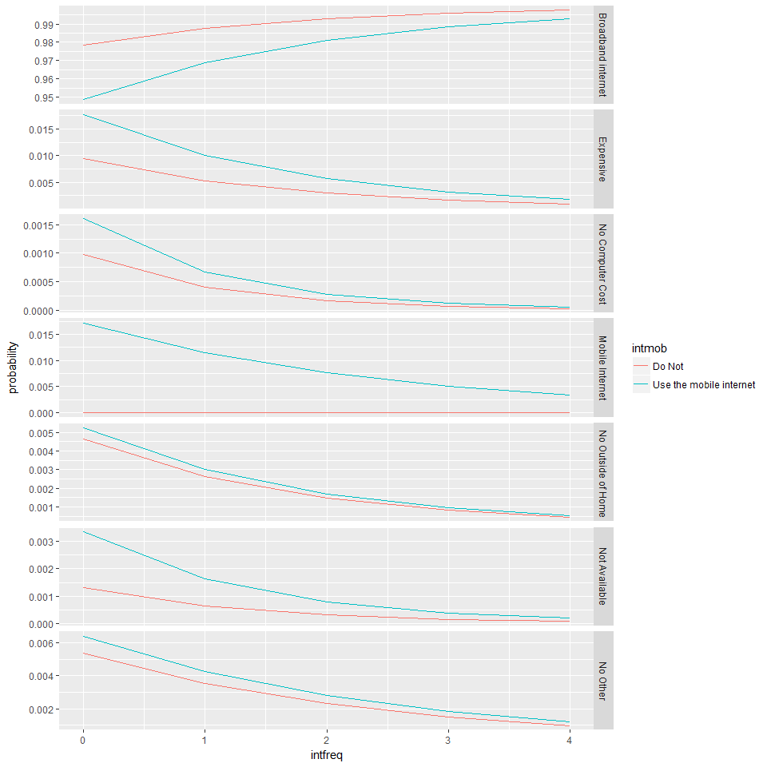

TV\_vs\_INT
================
Brandon Wolff
March 7, 2017

Thesis
------

``` r
#load and subset data
Proj <- read.csv("Gaming_Jobs_TV_Broadband.csv")

vars <- Proj[c("emplnw", "age", "educ2", "inc", "ï..psraid")]

myvars <- names(Proj) %in% c("emplnw", "age", "educ2", "inc") 
Proj <- Proj[!myvars]


# Change to NA
Proj[Proj == 8] <- NA # IDK
Proj[Proj == 9] <- NA # NA

vars[vars == 98] <- NA #IDK
vars[vars == 99] <- NA #NA

# mAKE EMPLOYMENT 1,2,3  
vars$emplnw[vars$emplnw == 3 | vars$emplnw == 4 | vars$emplnw == 6 | vars$emplnw == 7 | vars$emplnw == 8] <- 3
vars$emplnw[vars$emplnw == 5] <- 1
summary(vars$emplnw)
```

    ##    Min. 1st Qu.  Median    Mean 3rd Qu.    Max.    NA's 
    ##   1.000   1.000   2.000   2.004   3.000   3.000      10

``` r
# Married or not
Proj$marital[Proj$marital == 3 | Proj$marital == 4 | Proj$marital == 5 | Proj$marital == 6] <- 2
summary(Proj$marital)
```

    ##    Min. 1st Qu.  Median    Mean 3rd Qu.    Max.    NA's 
    ##   1.000   1.000   1.000   1.473   2.000   2.000      29

``` r
table(Proj$par)
```

    ## 
    ##    1    2 
    ##  477 1506

``` r
# reverse code
Proj[,c("cable2", "cable3c", "cable3a", "cable3b",  "sex", "marital", "par", "home4nw", "intmob", "bbsmart1", "bbsmart2", "bbsmart3a", "bbsmart3b", "bbsmart3c", "bbsmart3d", "bbsmart3e", "bbsmart3f")] <- 2-Proj[,c("cable2", "cable3c", "cable3a", "cable3b",  "sex", "marital", "par", "home4nw", "intmob", "bbsmart1", "bbsmart2", "bbsmart3a", "bbsmart3b", "bbsmart3c", "bbsmart3d", "bbsmart3e", "bbsmart3f")]

Proj[,c("cable1")] <- 2-Proj[,c("cable1")]

summary(Proj$cable2)
```

    ##    Min. 1st Qu.  Median    Mean 3rd Qu.    Max.    NA's 
    ##    0.00    0.00    1.00    0.59    1.00    1.00    1579

``` r
# reverse code
vars[,c("emplnw")] <- 3-vars[,c("emplnw")]


Proj[,c("stud")] <- 3-Proj[,c("stud")]


Proj[,c("intfreq")] <- -Proj[,c("intfreq")]

Proj1 <- merge(Proj, vars, by = "ï..psraid")

table(Proj1$race)
```

    ## 
    ##    1    2    3    4    5    6 
    ## 1513  246   54   49   17   68

``` r
# create new variable for generations
attach(Proj1)
Proj1$genage <- Proj1$age[age > 79] <- "G.I_Gen"
Proj1$genage[age > 70 & age <= 78] <- "Silent_Gen"
Proj1$genage[age > 61 & age <= 69] <- "Older_Boomers"
Proj1$genage[age > 51 & age <= 60] <- "Young_Boomers"
Proj1$genage[age > 35 & age <= 50] <- "Gen_X"
Proj1$genage[age <= 34] <- "Millennials"
detach(Proj1)


#make as factor and use a reference group

# millennials as REF 
table(Proj1$genage)
```

    ## 
    ##       G.I_Gen         Gen_X   Millennials Older_Boomers    Silent_Gen 
    ##           316           396           468           297           164 
    ## Young_Boomers 
    ##           360

``` r
Proj1$genage <- as.factor(Proj1$genage)
Proj1 <- within(Proj1, genage <- relevel(genage, ref = 3))

# white as ref

Proj1$race[Proj1$race == "1"] <- "White"
Proj1$race[Proj1$race == "2"] <- "Black or African-American"
Proj1$race[Proj1$race == "3"] <- "Asian or Pacific Islander"
Proj1$race[Proj1$race == "4"] <- "Mixed race"
Proj1$race[Proj1$race == "5"] <- "Native American/American Indian"
Proj1$race[Proj1$race == "6"] <- "Other"

Proj1$race <- as.factor(Proj1$race)
Proj1 <- within(Proj1, race <- relevel(race, ref = 6))

table(Proj1$race)
```

    ## 
    ##                           White       Asian or Pacific Islander 
    ##                            1513                              54 
    ##       Black or African-American                      Mixed race 
    ##                             246                              49 
    ## Native American/American Indian                           Other 
    ##                              17                              68

``` r
# midwest as ref. 

Proj1$cregion[Proj1$cregion == "1"] <- "Northeast"
Proj1$cregion[Proj1$cregion == "2"] <- "Midwest"
Proj1$cregion[Proj1$cregion == "3"] <- "South"
Proj1$cregion[Proj1$cregion == "4"] <- "West"

#create variable for cable vs not

Proj1$cabletest[Proj1$cable1 == 1] <- 1
Proj1$cabletest[Proj1$cable1 == 0 & Proj1$cable3a == 1 & Proj1$cable3b == 0 & Proj1$cable3c == 0] <- 2
Proj1$cabletest[Proj1$cable1 == 0 & Proj1$cable3a == 0 & Proj1$cable3b == 1 & Proj1$cable3c == 0] <- 3
Proj1$cabletest[Proj1$cable1 == 0 & Proj1$cable3a == 0 & Proj1$cable3b == 0 & Proj1$cable3c == 1] <- 4

Proj1$sumtest = Proj1$cable3a + Proj1$cable3b + Proj1$cable3c
table(Proj1$sumtest)
```

    ## 
    ##   0   1   2   3 
    ##  21 113 161  98

``` r
Proj1$cabletest[Proj1$cable1 == 0 & Proj1$sumtest > 1] <- 5
table(Proj1$cabletest)
```

    ## 
    ##    1    2    3    4    5 
    ## 1578   29   53   31  258

``` r
#create variable for hom int vs not

Proj1$home_inttest[Proj1$bbhome1 == 2] <- 1

Proj1$home_inttest[Proj1$bbhome1 == 3] <- 1

Proj1$home_inttest[Proj1$bbhome2 == 2] <- 1

Proj1$home_inttest[Proj1$bbsmart4 == 1] <- 2

Proj1$home_inttest[Proj1$bbsmart3a == 1 & Proj1$bbsmart3b == 0 & Proj1$bbsmart3c == 0 & Proj1$bbsmart3d == 0 & Proj1$bbsmart3e == 0 & Proj1$bbsmart3f == 0] <- 2

Proj1$home_inttest[Proj1$bbsmart4 == 2] <- 3

Proj1$home_inttest[Proj1$bbsmart3a == 0 & Proj1$bbsmart3b == 1 & Proj1$bbsmart3c == 0 & Proj1$bbsmart3d == 0 & Proj1$bbsmart3e == 0 & Proj1$bbsmart3f == 0] <- 3

Proj1$home_inttest[Proj1$bbsmart4 == 3] <- 4

Proj1$home_inttest[Proj1$bbsmart3a == 0 & Proj1$bbsmart3b == 0 & Proj1$bbsmart3c == 1 & Proj1$bbsmart3d == 0 & Proj1$bbsmart3e == 0 & Proj1$bbsmart3f == 0] <- 4

Proj1$home_inttest[Proj1$bbsmart4 == 4] <- 5

Proj1$home_inttest[Proj1$bbsmart3a == 0 & Proj1$bbsmart3b == 0 & Proj1$bbsmart3c == 0 & Proj1$bbsmart3d == 1 & Proj1$bbsmart3e == 0 & Proj1$bbsmart3f == 0] <- 5

Proj1$home_inttest[Proj1$bbsmart4 == 5] <- 6

Proj1$home_inttest[Proj1$bbsmart3a == 0 & Proj1$bbsmart3b == 0 & Proj1$bbsmart3c == 0 & Proj1$bbsmart3d == 0 & Proj1$bbsmart3e == 1 & Proj1$bbsmart3f == 0] <- 6

Proj1$home_inttest[Proj1$bbsmart4 == 6] <- 7

Proj1$home_inttest[Proj1$bbsmart3a == 0 & Proj1$bbsmart3b == 0 & Proj1$bbsmart3c == 0 & Proj1$bbsmart3d == 0 & Proj1$bbsmart3e == 0 & Proj1$bbsmart3f == 1] <- 7


table(Proj1$home_inttest)
```

    ## 
    ##    1    2    3    4    5    6    7 
    ## 1396  148   49   64   45   34   51

``` r
table(Proj1$home4nw)
```

    ## 
    ##    0    1 
    ##  229 1509

``` r
table(Proj1$bbsmart4)
```

    ## 
    ##   1   2   3   4   5   6 
    ## 143  49  60  42  32  43

``` r
table(Proj1$bbhome2)
```

    ## 
    ##  1  2 
    ## 35 10

``` r
#create variable for cable vs not AGAIN

Proj1$cable_cat[Proj1$cable1 == 1] <- 1
Proj1$cable_cat[Proj1$cable1 == 0 & Proj1$cable3a == 1 & Proj1$cable3b == 0 & Proj1$cable3c == 0] <- 2
Proj1$cable_cat[Proj1$cable1 == 0 & Proj1$cable3a == 0 & Proj1$cable3b == 1 & Proj1$cable3c == 0] <- 3
Proj1$cable_cat[Proj1$cable1 == 0 & Proj1$cable3a == 0 & Proj1$cable3b == 0 & Proj1$cable3c == 1] <- 4
Proj1$cable_cat[Proj1$cable1 == 0 & Proj1$cable3a == 1 & Proj1$cable3b == 1 & Proj1$cable3c == 0] <- 5
Proj1$cable_cat[Proj1$cable1 == 0 & Proj1$cable3a == 1 & Proj1$cable3b == 0 & Proj1$cable3c == 1] <- 6
Proj1$cable_cat[Proj1$cable1 == 0 & Proj1$cable3a == 0 & Proj1$cable3b == 1 & Proj1$cable3c == 1] <- 7
Proj1$cable_cat[Proj1$cable1 == 0 & Proj1$cable3a == 1 & Proj1$cable3b == 1 & Proj1$cable3c == 1] <- 8

table(Proj1$cable_cat)
```

    ## 
    ##    1    2    3    4    5    6    7    8 
    ## 1578   29   53   31   37   30   93   98

``` r
table(Proj1$emplnw)
```

    ## 
    ##   0   1   2 
    ## 891 217 883

Hypothesis 1
============

``` r
glm1 <- glm(intmob ~ genage + marital + par + race + cregion + inc + stud + educ2 + sex, data = Proj1, family = "binomial")
summary(glm1)
```

    ## 
    ## Call:
    ## glm(formula = intmob ~ genage + marital + par + race + cregion + 
    ##     inc + stud + educ2 + sex, family = "binomial", data = Proj1)
    ## 
    ## Deviance Residuals: 
    ##     Min       1Q   Median       3Q      Max  
    ## -2.9355   0.0873   0.3124   0.6476   1.9258  
    ## 
    ## Coefficients:
    ##                                     Estimate Std. Error z value Pr(>|z|)
    ## (Intercept)                          1.12567    0.33982   3.313 0.000924
    ## genageG.I_Gen                       -3.07151    0.30933  -9.930  < 2e-16
    ## genageGen_X                         -1.03827    0.33616  -3.089 0.002011
    ## genageOlder_Boomers                 -2.73753    0.31280  -8.752  < 2e-16
    ## genageSilent_Gen                    -3.43126    0.34478  -9.952  < 2e-16
    ## genageYoung_Boomers                 -2.27123    0.30693  -7.400 1.36e-13
    ## marital                             -0.02371    0.15858  -0.149 0.881172
    ## par                                  0.63172    0.22167   2.850 0.004374
    ## raceAsian or Pacific Islander        2.22150    1.09736   2.024 0.042929
    ## raceBlack or African-American        0.45297    0.21615   2.096 0.036114
    ## raceMixed race                       0.59889    0.55719   1.075 0.282440
    ## raceNative American/American Indian -0.52529    0.71276  -0.737 0.461135
    ## raceOther                            0.22780    0.39769   0.573 0.566772
    ## cregionNortheast                     0.25630    0.22719   1.128 0.259268
    ## cregionSouth                         0.30672    0.17588   1.744 0.081168
    ## cregionWest                          0.36457    0.20275   1.798 0.072148
    ## inc                                  0.28247    0.03723   7.587 3.28e-14
    ## stud                                 0.24668    0.21596   1.142 0.253362
    ## educ2                                0.10781    0.03984   2.706 0.006803
    ## sex                                 -0.34412    0.14100  -2.441 0.014664
    ##                                        
    ## (Intercept)                         ***
    ## genageG.I_Gen                       ***
    ## genageGen_X                         ** 
    ## genageOlder_Boomers                 ***
    ## genageSilent_Gen                    ***
    ## genageYoung_Boomers                 ***
    ## marital                                
    ## par                                 ** 
    ## raceAsian or Pacific Islander       *  
    ## raceBlack or African-American       *  
    ## raceMixed race                         
    ## raceNative American/American Indian    
    ## raceOther                              
    ## cregionNortheast                       
    ## cregionSouth                        .  
    ## cregionWest                         .  
    ## inc                                 ***
    ## stud                                   
    ## educ2                               ** 
    ## sex                                 *  
    ## ---
    ## Signif. codes:  0 '***' 0.001 '**' 0.01 '*' 0.05 '.' 0.1 ' ' 1
    ## 
    ## (Dispersion parameter for binomial family taken to be 1)
    ## 
    ##     Null deviance: 1789.8  on 1639  degrees of freedom
    ## Residual deviance: 1315.0  on 1620  degrees of freedom
    ##   (361 observations deleted due to missingness)
    ## AIC: 1355
    ## 
    ## Number of Fisher Scoring iterations: 6

``` r
exp(coef(glm1))
```

    ##                         (Intercept)                       genageG.I_Gen 
    ##                          3.08228739                          0.04635108 
    ##                         genageGen_X                 genageOlder_Boomers 
    ##                          0.35406588                          0.06473002 
    ##                    genageSilent_Gen                 genageYoung_Boomers 
    ##                          0.03234613                          0.10318534 
    ##                             marital                                 par 
    ##                          0.97657326                          1.88083708 
    ##       raceAsian or Pacific Islander       raceBlack or African-American 
    ##                          9.22112969                          1.57297148 
    ##                      raceMixed race raceNative American/American Indian 
    ##                          1.82010319                          0.59138592 
    ##                           raceOther                    cregionNortheast 
    ##                          1.25583951                          1.29214242 
    ##                        cregionSouth                         cregionWest 
    ##                          1.35896705                          1.43989784 
    ##                                 inc                                stud 
    ##                          1.32640788                          1.27976756 
    ##                               educ2                                 sex 
    ##                          1.11383957                          0.70884603

Hypothesis 2
============

``` r
glm2 <- glm(cable1 ~ intmob + sex + genage + marital + par + race + cregion + inc + stud + educ2, data = Proj1, family = "binomial")
summary(glm2)
```

    ## 
    ## Call:
    ## glm(formula = cable1 ~ intmob + sex + genage + marital + par + 
    ##     race + cregion + inc + stud + educ2, family = "binomial", 
    ##     data = Proj1)
    ## 
    ## Deviance Residuals: 
    ##     Min       1Q   Median       3Q      Max  
    ## -2.6430   0.3261   0.5301   0.7183   1.6097  
    ## 
    ## Coefficients:
    ##                                     Estimate Std. Error z value Pr(>|z|)
    ## (Intercept)                         -0.16154    0.27873  -0.580 0.562195
    ## intmob                               0.43406    0.17573   2.470 0.013510
    ## sex                                 -0.24290    0.12878  -1.886 0.059273
    ## genageG.I_Gen                        1.60629    0.26401   6.084 1.17e-09
    ## genageGen_X                          0.55531    0.18169   3.056 0.002240
    ## genageOlder_Boomers                  1.02817    0.23844   4.312 1.62e-05
    ## genageSilent_Gen                     1.62836    0.34743   4.687 2.77e-06
    ## genageYoung_Boomers                  0.78563    0.20804   3.776 0.000159
    ## marital                              0.03016    0.14910   0.202 0.839717
    ## par                                 -0.39239    0.16136  -2.432 0.015029
    ## raceAsian or Pacific Islander       -0.53093    0.33912  -1.566 0.117443
    ## raceBlack or African-American        0.39432    0.20100   1.962 0.049783
    ## raceMixed race                       0.81393    0.46081   1.766 0.077344
    ## raceNative American/American Indian -1.14550    0.55685  -2.057 0.039676
    ## raceOther                            0.34752    0.32270   1.077 0.281515
    ## cregionNortheast                     0.27816    0.22387   1.243 0.214051
    ## cregionSouth                        -0.02759    0.16771  -0.164 0.869348
    ## cregionWest                         -0.47235    0.18350  -2.574 0.010050
    ## inc                                  0.21514    0.03286   6.547 5.86e-11
    ## stud                                 0.06707    0.12043   0.557 0.577586
    ## educ2                               -0.07668    0.03631  -2.112 0.034716
    ##                                        
    ## (Intercept)                            
    ## intmob                              *  
    ## sex                                 .  
    ## genageG.I_Gen                       ***
    ## genageGen_X                         ** 
    ## genageOlder_Boomers                 ***
    ## genageSilent_Gen                    ***
    ## genageYoung_Boomers                 ***
    ## marital                                
    ## par                                 *  
    ## raceAsian or Pacific Islander          
    ## raceBlack or African-American       *  
    ## raceMixed race                      .  
    ## raceNative American/American Indian *  
    ## raceOther                              
    ## cregionNortheast                       
    ## cregionSouth                           
    ## cregionWest                         *  
    ## inc                                 ***
    ## stud                                   
    ## educ2                               *  
    ## ---
    ## Signif. codes:  0 '***' 0.001 '**' 0.01 '*' 0.05 '.' 0.1 ' ' 1
    ## 
    ## (Dispersion parameter for binomial family taken to be 1)
    ## 
    ##     Null deviance: 1730.3  on 1637  degrees of freedom
    ## Residual deviance: 1563.3  on 1617  degrees of freedom
    ##   (363 observations deleted due to missingness)
    ## AIC: 1605.3
    ## 
    ## Number of Fisher Scoring iterations: 4

``` r
exp(coef(glm2))
```

    ##                         (Intercept)                              intmob 
    ##                           0.8508286                           1.5435057 
    ##                                 sex                       genageG.I_Gen 
    ##                           0.7843480                           4.9842776 
    ##                         genageGen_X                 genageOlder_Boomers 
    ##                           1.7424826                           2.7959335 
    ##                    genageSilent_Gen                 genageYoung_Boomers 
    ##                           5.0954938                           2.1937859 
    ##                             marital                                 par 
    ##                           1.0306152                           0.6754434 
    ##       raceAsian or Pacific Islander       raceBlack or African-American 
    ##                           0.5880584                           1.4833796 
    ##                      raceMixed race raceNative American/American Indian 
    ##                           2.2567701                           0.3180660 
    ##                           raceOther                    cregionNortheast 
    ##                           1.4155495                           1.3206936 
    ##                        cregionSouth                         cregionWest 
    ##                           0.9727905                           0.6235363 
    ##                                 inc                                stud 
    ##                           1.2400370                           1.0693721 
    ##                               educ2 
    ##                           0.9261857

``` r
glm3 <- glm(home4nw ~ intmob + sex + genage + marital + par + race + cregion + inc + stud + educ2, data = Proj1, family = "binomial")
summary(glm3)
```

    ## 
    ## Call:
    ## glm(formula = home4nw ~ intmob + sex + genage + marital + par + 
    ##     race + cregion + inc + stud + educ2, family = "binomial", 
    ##     data = Proj1)
    ## 
    ## Deviance Residuals: 
    ##     Min       1Q   Median       3Q      Max  
    ## -2.9051   0.2374   0.3663   0.5432   1.4837  
    ## 
    ## Coefficients:
    ##                                     Estimate Std. Error z value Pr(>|z|)
    ## (Intercept)                         -0.01283    0.40507  -0.032 0.974736
    ## intmob                              -0.01315    0.26261  -0.050 0.960069
    ## sex                                 -0.48861    0.17086  -2.860 0.004241
    ## genageG.I_Gen                       -0.06769    0.30608  -0.221 0.824974
    ## genageGen_X                         -0.14386    0.23776  -0.605 0.545144
    ## genageOlder_Boomers                  0.03032    0.31795   0.095 0.924018
    ## genageSilent_Gen                     0.93445    0.56478   1.655 0.098014
    ## genageYoung_Boomers                 -0.42093    0.25935  -1.623 0.104584
    ## marital                              0.66763    0.19605   3.405 0.000661
    ## par                                 -0.11153    0.20592  -0.542 0.588091
    ## raceAsian or Pacific Islander       -0.26193    0.57023  -0.459 0.645996
    ## raceBlack or African-American       -0.62275    0.21466  -2.901 0.003718
    ## raceMixed race                      -0.47791    0.46539  -1.027 0.304465
    ## raceNative American/American Indian -0.59951    0.87306  -0.687 0.492292
    ## raceOther                           -0.34990    0.37772  -0.926 0.354261
    ## cregionNortheast                     0.07005    0.27460   0.255 0.798644
    ## cregionSouth                        -0.04952    0.21573  -0.230 0.818441
    ## cregionWest                          0.35228    0.26150   1.347 0.177935
    ## inc                                  0.22782    0.04245   5.367 8.01e-08
    ## stud                                 0.49273    0.18341   2.686 0.007220
    ## educ2                                0.18913    0.05017   3.770 0.000163
    ##                                        
    ## (Intercept)                            
    ## intmob                                 
    ## sex                                 ** 
    ## genageG.I_Gen                          
    ## genageGen_X                            
    ## genageOlder_Boomers                    
    ## genageSilent_Gen                    .  
    ## genageYoung_Boomers                    
    ## marital                             ***
    ## par                                    
    ## raceAsian or Pacific Islander          
    ## raceBlack or African-American       ** 
    ## raceMixed race                         
    ## raceNative American/American Indian    
    ## raceOther                              
    ## cregionNortheast                       
    ## cregionSouth                           
    ## cregionWest                            
    ## inc                                 ***
    ## stud                                ** 
    ## educ2                               ***
    ## ---
    ## Signif. codes:  0 '***' 0.001 '**' 0.01 '*' 0.05 '.' 0.1 ' ' 1
    ## 
    ## (Dispersion parameter for binomial family taken to be 1)
    ## 
    ##     Null deviance: 1155.80  on 1448  degrees of freedom
    ## Residual deviance:  981.07  on 1428  degrees of freedom
    ##   (552 observations deleted due to missingness)
    ## AIC: 1023.1
    ## 
    ## Number of Fisher Scoring iterations: 5

``` r
exp(coef(glm3))
```

    ##                         (Intercept)                              intmob 
    ##                           0.9872540                           0.9869377 
    ##                                 sex                       genageG.I_Gen 
    ##                           0.6134759                           0.9345498 
    ##                         genageGen_X                 genageOlder_Boomers 
    ##                           0.8660093                           1.0307880 
    ##                    genageSilent_Gen                 genageYoung_Boomers 
    ##                           2.5458228                           0.6564379 
    ##                             marital                                 par 
    ##                           1.9496139                           0.8944683 
    ##       raceAsian or Pacific Islander       raceBlack or African-American 
    ##                           0.7695679                           0.5364651 
    ##                      raceMixed race raceNative American/American Indian 
    ##                           0.6200783                           0.5490832 
    ##                           raceOther                    cregionNortheast 
    ##                           0.7047552                           1.0725626 
    ##                        cregionSouth                         cregionWest 
    ##                           0.9516854                           1.4223077 
    ##                                 inc                                stud 
    ##                           1.2558571                           1.6367809 
    ##                               educ2 
    ##                           1.2081976

Hypothesis 3
============

``` r
#create new variable for income
attach(Proj1)
Proj1$inc_cat <- Proj1$inc[inc > 7] <- "High"
Proj1$inc_cat[inc > 4 & inc <= 7] <- "Middle"
Proj1$inc_cat[inc <= 3] <- "Low"
detach(Proj1)
table(Proj1$inc_cat)
```

    ## 
    ##   High    Low Middle 
    ##    830    524    647

``` r
library(nnet)
```

    ## Warning: package 'nnet' was built under R version 3.3.2

``` r
## build internet model 

table(Proj1$bbsmart4)
```

    ## 
    ##   1   2   3   4   5   6 
    ## 143  49  60  42  32  43

``` r
Proj1$home_inttest <- factor(Proj1$home_inttest, labels = c("Broadband internet", "Expensive", "No Computer Cost", "Mobile Internet", " No Outside of Home", "Not Available", "No Other"))
table(Proj1$home_inttest)
```

    ## 
    ##  Broadband internet           Expensive    No Computer Cost 
    ##                1396                 148                  49 
    ##     Mobile Internet  No Outside of Home       Not Available 
    ##                  64                  45                  34 
    ##            No Other 
    ##                  51

``` r
Proj1 <- within(Proj1, home_inttest <- relevel(home_inttest, ref = "Broadband internet"))

multinom_home_int1 <- multinom(home_inttest ~ bbsmart1 + bbsmart2 + race + inc_cat + stud + marital + educ2 + par + sex + genage + intmob + intfreq +  cable1 + cregion , Proj1)
```

    ## Warning in multinom(home_inttest ~ bbsmart1 + bbsmart2 + race + inc_cat + :
    ## group 'Broadband internet' is empty

    ## # weights:  162 (130 variable)
    ## initial  value 419.271716 
    ## iter  10 value 329.744378
    ## iter  20 value 292.175340
    ## iter  30 value 288.657888
    ## iter  40 value 288.109984
    ## iter  50 value 288.006619
    ## iter  60 value 287.981340
    ## iter  70 value 287.972765
    ## iter  80 value 287.970111
    ## iter  90 value 287.969754
    ## final  value 287.969721 
    ## converged

``` r
multinom_home_int <- multinom(home_inttest ~ race + intfreq, Proj1)
```

    ## # weights:  56 (42 variable)
    ## initial  value 3127.077610 
    ## iter  10 value 1751.355151
    ## iter  20 value 1081.934981
    ## iter  30 value 1046.276061
    ## iter  40 value 1046.086862
    ## iter  50 value 1046.026612
    ## final  value 1046.026190 
    ## converged

``` r
summary(multinom_home_int1)
```

    ## Call:
    ## multinom(formula = home_inttest ~ bbsmart1 + bbsmart2 + race + 
    ##     inc_cat + stud + marital + educ2 + par + sex + genage + intmob + 
    ##     intfreq + cable1 + cregion, data = Proj1)
    ## 
    ## Coefficients:
    ##                     (Intercept)    bbsmart1   bbsmart2
    ## No Computer Cost      -2.712593 -0.08010632 -0.1708445
    ## Mobile Internet      -24.741273 -0.56985799 -1.3049429
    ##  No Outside of Home   -4.146130 -0.13700754 -1.9466476
    ## Not Available         -3.449316 -0.61084342  0.9437391
    ## No Other               1.148946 -0.11387337  0.5095522
    ##                     raceAsian or Pacific Islander
    ## No Computer Cost                      1.663279023
    ## Mobile Internet                     -14.728653757
    ##  No Outside of Home                  -0.416397959
    ## Not Available                        -0.005840704
    ## No Other                              1.112383409
    ##                     raceBlack or African-American raceMixed race
    ## No Computer Cost                       0.02438285     -14.447340
    ## Mobile Internet                        0.34057962       2.455745
    ##  No Outside of Home                   -0.06540274     -23.359802
    ## Not Available                         -0.05855871     -13.385777
    ## No Other                              -0.01074723       1.170698
    ##                     raceNative American/American Indian  raceOther
    ## No Computer Cost                              17.712513  0.7368683
    ## Mobile Internet                               16.031158 -1.7172594
    ##  No Outside of Home                          -12.249782  1.8794771
    ## Not Available                                 -4.376155  1.0822203
    ## No Other                                      -6.586226 -0.3810020
    ##                     inc_catLow inc_catMiddle         stud    marital
    ## No Computer Cost    -0.3104899    -0.6378640  -0.08735088 -0.8683584
    ## Mobile Internet     -1.9622504    -0.2489408  -0.59224390 -1.0501050
    ##  No Outside of Home  0.4364928     1.6122558   0.47238097 -0.5776944
    ## Not Available       -0.4908666     0.7020761 -13.56749521 -0.5871950
    ## No Other            -1.7317465    -1.4722242  -0.22946627 -0.2630659
    ##                           educ2        par       sex genageG.I_Gen
    ## No Computer Cost     0.06004232 -0.4176659 1.3203523   -2.50655888
    ## Mobile Internet     -0.07688761 -0.1082933 1.4349756    0.03442924
    ##  No Outside of Home  0.26773527  0.9173189 1.2295660   -2.02211467
    ## Not Available        0.14163357  0.1553708 0.6143749   -0.65937800
    ## No Other             0.05749577 -1.0111363 0.8205344   -0.74500334
    ##                     genageGen_X genageOlder_Boomers genageSilent_Gen
    ## No Computer Cost     0.19479721         -0.77627656      -21.2917493
    ## Mobile Internet      0.08648203         -0.27755164        2.6282564
    ##  No Outside of Home -0.80674056         -1.02939562       -1.8370532
    ## Not Available       -0.75277606         -0.23033579        0.3996694
    ## No Other            -0.40012923         -0.01667467      -21.2287675
    ##                     genageYoung_Boomers     intmob     intfreq      cable1
    ## No Computer Cost             -0.3366084 -1.0192649 -0.46675518  1.28550742
    ## Mobile Internet              -1.4744544 26.6941058  0.21275667  0.05071906
    ##  No Outside of Home          -0.9275813 -0.4075794 -0.33479718  1.13120805
    ## Not Available                -0.0368826  0.8556162 -0.26739508  0.44835137
    ## No Other                     -0.5911207 -0.6672782  0.09417068 -1.19765883
    ##                     cregionNortheast cregionSouth cregionWest
    ## No Computer Cost           0.5460262   -0.2491082   0.5240045
    ## Mobile Internet           -0.3202934   -0.3146847  -0.1675829
    ##  No Outside of Home        1.8251857   -0.2597670  -0.3840680
    ## Not Available              0.6852166   -0.2432066  -0.7311150
    ## No Other                   0.9802716   -0.4619968  -0.2934419
    ## 
    ## Std. Errors:
    ##                     (Intercept)  bbsmart1  bbsmart2
    ## No Computer Cost      1.7737865 0.5635217 0.6223736
    ## Mobile Internet       0.5623928 0.4549447 0.5362056
    ##  No Outside of Home   1.6305879 0.5220115 0.7470800
    ## Not Available         1.7533514 0.5333841 0.5471620
    ## No Other              1.6718147 0.5898076 0.6089836
    ##                     raceAsian or Pacific Islander
    ## No Computer Cost                     1.974715e+00
    ## Mobile Internet                      2.510121e-06
    ##  No Outside of Home                  1.914359e+00
    ## Not Available                        3.569526e-12
    ## No Other                             1.879611e+00
    ##                     raceBlack or African-American raceMixed race
    ## No Computer Cost                        0.7013133   1.263376e-06
    ## Mobile Internet                         0.5800597   1.365720e+00
    ##  No Outside of Home                     0.6656475   1.890000e-09
    ## Not Available                           0.6792040   2.528715e-06
    ## No Other                                0.7836448   1.769148e+00
    ##                     raceNative American/American Indian raceOther
    ## No Computer Cost                           1.111792e+00  1.046450
    ## Mobile Internet                            1.111792e+00  1.337252
    ##  No Outside of Home                        2.475132e-12  1.051620
    ## Not Available                              7.005191e-10  1.172129
    ## No Other                                   1.687654e-10  1.387344
    ##                     inc_catLow inc_catMiddle         stud   marital
    ## No Computer Cost     0.7212948     0.8660865 6.443584e-01 0.7093071
    ## Mobile Internet      0.6090465     0.6240440 5.527625e-01 0.5233425
    ##  No Outside of Home  0.7685934     0.7914329 4.745543e-01 0.5844213
    ## Not Available        0.7615018     0.7286636 1.431878e-06 0.5629679
    ## No Other             0.7091890     0.7827419 6.122387e-01 0.6434451
    ##                         educ2       par       sex genageG.I_Gen
    ## No Computer Cost    0.1766014 0.6768124 0.5728768     1.4004771
    ## Mobile Internet     0.1440614 0.5115848 0.4668937     0.8386277
    ##  No Outside of Home 0.1575907 0.6077121 0.5259649     1.0943922
    ## Not Available       0.1498385 0.6241992 0.5241175     1.0388194
    ## No Other            0.1743284 0.7482605 0.5788873     1.3481558
    ##                     genageGen_X genageOlder_Boomers genageSilent_Gen
    ## No Computer Cost      0.7261077           1.0760387     8.634015e-09
    ## Mobile Internet       0.5973342           0.8234016     1.531708e+00
    ##  No Outside of Home   0.7237661           0.9814915     1.652516e+00
    ## Not Available         0.7900074           0.9732239     1.604384e+00
    ## No Other              0.8450067           1.0098874     6.775930e-09
    ##                     genageYoung_Boomers    intmob   intfreq    cable1
    ## No Computer Cost              0.9061016 0.8032966 0.2137352 0.6272388
    ## Mobile Internet               0.8675036 0.5623928 0.1888484 0.4885315
    ##  No Outside of Home           0.8857331 0.7377275 0.2016926 0.5660187
    ## Not Available                 0.8179071 0.9782747 0.2106876 0.5677990
    ## No Other                      0.8813827 0.8615060 0.2357601 0.6602093
    ##                     cregionNortheast cregionSouth cregionWest
    ## No Computer Cost           1.0784337    0.7138277   0.8675240
    ## Mobile Internet            0.8744873    0.5726812   0.6912561
    ##  No Outside of Home        0.8814284    0.6895673   0.9004861
    ## Not Available              0.9358928    0.6772674   0.9483403
    ## No Other                   0.8962015    0.7507924   0.9112927
    ## 
    ## Residual Deviance: 575.9394 
    ## AIC: 835.9394

``` r
z1 <- summary(multinom_home_int1)$coefficients/summary(multinom_home_int1)$standard.errors
z1
```

    ##                     (Intercept)   bbsmart1   bbsmart2
    ## No Computer Cost      -1.529267 -0.1421531 -0.2745048
    ## Mobile Internet      -43.992868 -1.2525875 -2.4336613
    ##  No Outside of Home   -2.542721 -0.2624608 -2.6056748
    ## Not Available         -1.967270 -1.1452224  1.7247892
    ## No Other               0.687245 -0.1930687  0.8367257
    ##                     raceAsian or Pacific Islander
    ## No Computer Cost                     8.422881e-01
    ## Mobile Internet                     -5.867706e+06
    ##  No Outside of Home                 -2.175130e-01
    ## Not Available                       -1.636269e+09
    ## No Other                             5.918158e-01
    ##                     raceBlack or African-American raceMixed race
    ## No Computer Cost                       0.03476741  -1.143551e+07
    ## Mobile Internet                        0.58714579   1.798132e+00
    ##  No Outside of Home                   -0.09825432  -1.235968e+10
    ## Not Available                         -0.08621668  -5.293511e+06
    ## No Other                              -0.01371442   6.617297e-01
    ##                     raceNative American/American Indian  raceOther
    ## No Computer Cost                           1.593150e+01  0.7041602
    ## Mobile Internet                            1.441921e+01 -1.2841705
    ##  No Outside of Home                       -4.949143e+12  1.7872201
    ## Not Available                             -6.247017e+09  0.9232945
    ## No Other                                  -3.902592e+10 -0.2746270
    ##                     inc_catLow inc_catMiddle          stud    marital
    ## No Computer Cost    -0.4304619    -0.7364900 -1.355626e-01 -1.2242347
    ## Mobile Internet     -3.2218402    -0.3989155 -1.071426e+00 -2.0065349
    ##  No Outside of Home  0.5679112     2.0371352  9.954203e-01 -0.9884896
    ## Not Available       -0.6446033     0.9635119 -9.475314e+06 -1.0430346
    ## No Other            -2.4418688    -1.8808553 -3.747987e-01 -0.4088397
    ##                          educ2        par      sex genageG.I_Gen
    ## No Computer Cost     0.3399879 -0.6171073 2.304775   -1.78978930
    ## Mobile Internet     -0.5337140 -0.2116820 3.073453    0.04105426
    ##  No Outside of Home  1.6989286  1.5094630 2.337734   -1.84770565
    ## Not Available        0.9452418  0.2489122 1.172208   -0.63473787
    ## No Other             0.3298130 -1.3513159 1.417434   -0.55260925
    ##                     genageGen_X genageOlder_Boomers genageSilent_Gen
    ## No Computer Cost      0.2682759         -0.72142070    -2.466031e+09
    ## Mobile Internet       0.1447800         -0.33707931     1.715899e+00
    ##  No Outside of Home  -1.1146426         -1.04880743    -1.111670e+00
    ## Not Available        -0.9528722         -0.23667297     2.491108e-01
    ## No Other             -0.4735219         -0.01651141    -3.132967e+09
    ##                     genageYoung_Boomers     intmob    intfreq     cable1
    ## No Computer Cost            -0.37149078 -1.2688524 -2.1838010  2.0494704
    ## Mobile Internet             -1.69965217 47.4652332  1.1266006  0.1038194
    ##  No Outside of Home         -1.04724703 -0.5524797 -1.6599379  1.9985346
    ## Not Available               -0.04509387  0.8746175 -1.2691540  0.7896304
    ## No Other                    -0.67067428 -0.7745485  0.3994344 -1.8140594
    ##                     cregionNortheast cregionSouth cregionWest
    ## No Computer Cost           0.5063141   -0.3489752   0.6040231
    ## Mobile Internet           -0.3662642   -0.5494936  -0.2424324
    ##  No Outside of Home        2.0707136   -0.3767101  -0.4265118
    ## Not Available              0.7321528   -0.3590998  -0.7709416
    ## No Other                   1.0938072   -0.6153456  -0.3220061

``` r
# 2-tailed z test
p1 <- (1 - pnorm(abs(z1), 0, 1)) * 2
p1
```

    ##                     (Intercept)  bbsmart1    bbsmart2
    ## No Computer Cost     0.12619827 0.8869591 0.783696752
    ## Mobile Internet      0.00000000 0.2103559 0.014946975
    ##  No Outside of Home  0.01099929 0.7929662 0.009169348
    ## Not Available        0.04915206 0.2521170 0.084565467
    ## No Other             0.49192833 0.8469052 0.402746753
    ##                     raceAsian or Pacific Islander
    ## No Computer Cost                        0.3996267
    ## Mobile Internet                         0.0000000
    ##  No Outside of Home                     0.8278086
    ## Not Available                           0.0000000
    ## No Other                                0.5539740
    ##                     raceBlack or African-American raceMixed race
    ## No Computer Cost                        0.9722652      0.0000000
    ## Mobile Internet                         0.5571058      0.0721561
    ##  No Outside of Home                     0.9217303      0.0000000
    ## Not Available                           0.9312942      0.0000000
    ## No Other                                0.9890578      0.5081444
    ##                     raceNative American/American Indian  raceOther
    ## No Computer Cost                                      0 0.48133303
    ## Mobile Internet                                       0 0.19908231
    ##  No Outside of Home                                   0 0.07390191
    ## Not Available                                         0 0.35585377
    ## No Other                                              0 0.78360283
    ##                      inc_catLow inc_catMiddle      stud    marital
    ## No Computer Cost    0.666859652    0.46143255 0.8921671 0.22086369
    ## Mobile Internet     0.001273702    0.68995546 0.2839781 0.04479921
    ##  No Outside of Home 0.570095246    0.04163649 0.3195319 0.32291293
    ## Not Available       0.519184268    0.33529071 0.0000000 0.29693228
    ## No Other            0.014611456    0.05999161 0.7078102 0.68265729
    ##                          educ2       par         sex genageG.I_Gen
    ## No Computer Cost    0.73386568 0.5371639 0.021179151    0.07348779
    ## Mobile Internet     0.59353942 0.8323551 0.002115972    0.96725264
    ##  No Outside of Home 0.08933264 0.1311805 0.019401059    0.06464494
    ## Not Available       0.34453547 0.8034287 0.241113386    0.52559939
    ## No Other            0.74154126 0.1765943 0.156356147    0.58053101
    ##                     genageGen_X genageOlder_Boomers genageSilent_Gen
    ## No Computer Cost      0.7884869           0.4706507       0.00000000
    ## Mobile Internet       0.8848846           0.7360571       0.08618051
    ##  No Outside of Home   0.2650036           0.2942668       0.26627988
    ## Not Available         0.3406548           0.8129105       0.80327507
    ## No Other              0.6358409           0.9868264       0.00000000
    ##                     genageYoung_Boomers    intmob    intfreq     cable1
    ## No Computer Cost             0.71027202 0.2044937 0.02897687 0.04041614
    ## Mobile Internet              0.08919637 0.0000000 0.25991139 0.91731266
    ##  No Outside of Home          0.29498566 0.5806198 0.09692694 0.04565873
    ## Not Available                0.96403249 0.3817821 0.20438613 0.42974365
    ## No Other                     0.50242805 0.4386065 0.68957318 0.06966858
    ##                     cregionNortheast cregionSouth cregionWest
    ## No Computer Cost          0.61263620    0.7271079   0.5458283
    ## Mobile Internet           0.71416794    0.5826667   0.8084451
    ##  No Outside of Home       0.03838557    0.7063890   0.6697349
    ## Not Available             0.46407529    0.7195204   0.4407415
    ## No Other                  0.27403956    0.5383265   0.7474480

``` r
## extract the coefficients from the model and exponentiate
exp(coef(multinom_home_int1))
```

    ##                      (Intercept)  bbsmart1  bbsmart2
    ## No Computer Cost    6.636449e-02 0.9230182 0.8429526
    ## Mobile Internet     1.798878e-11 0.5656058 0.2711880
    ##  No Outside of Home 1.582554e-02 0.8719636 0.1427518
    ## Not Available       3.176735e-02 0.5428928 2.5695714
    ## No Other            3.154867e+00 0.8923710 1.6645457
    ##                     raceAsian or Pacific Islander
    ## No Computer Cost                     5.276585e+00
    ## Mobile Internet                      4.012610e-07
    ##  No Outside of Home                  6.594178e-01
    ## Not Available                        9.941763e-01
    ## No Other                             3.041599e+00
    ##                     raceBlack or African-American raceMixed race
    ## No Computer Cost                        1.0246825   5.316181e-07
    ## Mobile Internet                         1.4057622   1.165512e+01
    ##  No Outside of Home                     0.9366901   7.160891e-11
    ## Not Available                           0.9431229   1.536848e-06
    ## No Other                                0.9893103   3.224243e+00
    ##                     raceNative American/American Indian raceOther
    ## No Computer Cost                           4.925460e+07 2.0893819
    ## Mobile Internet                            9.167344e+06 0.1795576
    ##  No Outside of Home                        4.786158e-06 6.5500787
    ## Not Available                              1.257361e-02 2.9512247
    ## No Other                                   1.379236e-03 0.6831765
    ##                     inc_catLow inc_catMiddle         stud   marital
    ## No Computer Cost     0.7330877     0.5284199 9.163555e-01 0.4196399
    ## Mobile Internet      0.1405418     0.7796261 5.530848e-01 0.3499010
    ##  No Outside of Home  1.5472711     5.0141094 1.603808e+00 0.5611908
    ## Not Available        0.6120957     2.0179377 1.281480e-06 0.5558844
    ## No Other             0.1769750     0.2294147 7.949578e-01 0.7686912
    ##                         educ2       par      sex genageG.I_Gen genageGen_X
    ## No Computer Cost    1.0618815 0.6585822 3.744741    0.08154837   1.2150646
    ## Mobile Internet     0.9259939 0.8973644 4.199543    1.03502879   1.0903318
    ##  No Outside of Home 1.3070011 2.5025718 3.419745    0.13237524   0.4463104
    ## Not Available       1.1521544 1.1680910 1.848501    0.51717292   0.4710571
    ## No Other            1.0591808 0.3638054 2.271713    0.47473271   0.6702334
    ##                     genageOlder_Boomers genageSilent_Gen
    ## No Computer Cost              0.4601160     5.663837e-10
    ## Mobile Internet               0.7576364     1.384960e+01
    ##  No Outside of Home           0.3572228     1.592861e-01
    ## Not Available                 0.7942668     1.491332e+00
    ## No Other                      0.9834636     6.032029e-10
    ##                     genageYoung_Boomers       intmob   intfreq    cable1
    ## No Computer Cost              0.7141885 3.608601e-01 0.6270336 3.6165026
    ## Mobile Internet               0.2289036 3.918347e+11 1.2370836 1.0520273
    ##  No Outside of Home           0.3955092 6.652586e-01 0.7154832 3.0993985
    ## Not Available                 0.9637893 2.352824e+00 0.7653706 1.5657287
    ## No Other                      0.5537064 5.131033e-01 1.0987473 0.3019002
    ##                     cregionNortheast cregionSouth cregionWest
    ## No Computer Cost            1.726379    0.7794956   1.6887769
    ## Mobile Internet             0.725936    0.7300190   0.8457065
    ##  No Outside of Home         6.203947    0.7712313   0.6810851
    ## Not Available               1.984202    0.7841095   0.4813720
    ## No Other                    2.665180    0.6300244   0.7456926

``` r
head(pp <- fitted(multinom_home_int1))
```

    ##    Expensive No Computer Cost Mobile Internet  No Outside of Home
    ## 34 0.1129356      0.560168257    1.145563e-01         0.158142858
    ## 41 0.5072814      0.096725472    1.545716e-01         0.034455139
    ## 42 0.6833042      0.043988710    4.914035e-02         0.006462175
    ## 45 0.6249335      0.038452163    4.293486e-12         0.183564494
    ## 67 0.3915159      0.047039176    1.093670e-01         0.236657110
    ## 98 0.1753875      0.002913468    3.329150e-01         0.280479860
    ##    Not Available   No Other
    ## 34    0.04191899 0.01227798
    ## 41    0.08286553 0.12410092
    ## 42    0.18525239 0.03185219
    ## 45    0.08916048 0.06388932
    ## 67    0.18210808 0.03331273
    ## 98    0.17243619 0.03586803

Hypothesis 4
============

``` r
Proj1$cabletest <- factor(Proj1$cabletest, labels = c("cable", "dont_watch", "No_cost", "internet", "multi_reason"))
table(Proj1$cabletest)
```

    ## 
    ##        cable   dont_watch      No_cost     internet multi_reason 
    ##         1578           29           53           31          258

``` r
Proj1 <- within(Proj1, cabletest <- relevel(cabletest, ref = "cable"))

multinom_cable1 <- multinom(cabletest ~ cable2 + race + inc_cat + stud + marital + educ2 + par + sex + genage + intmob + intfreq + home4nw + as.factor(cregion), Proj1)
```

    ## Warning in multinom(cabletest ~ cable2 + race + inc_cat + stud + marital
    ## + : group 'cable' is empty

    ## # weights:  104 (75 variable)
    ## initial  value 424.206075 
    ## iter  10 value 241.960834
    ## iter  20 value 222.276841
    ## iter  30 value 219.044074
    ## iter  40 value 218.626869
    ## iter  50 value 218.489603
    ## iter  60 value 218.415040
    ## iter  70 value 218.413084
    ## final  value 218.413063 
    ## converged

``` r
multinom_cable <- multinom(cabletest ~ race + inc, Proj1)
```

    ## # weights:  70 (52 variable)
    ## initial  value 2615.336608 
    ## iter  10 value 1441.385491
    ## iter  20 value 1104.328777
    ## iter  30 value 1058.399859
    ## iter  40 value 1056.029233
    ## iter  50 value 1055.977359
    ## iter  60 value 1055.932421
    ## final  value 1055.931025 
    ## converged

``` r
summary(multinom_cable)
```

    ## Warning in sqrt(diag(vc)): NaNs produced

    ## Call:
    ## multinom(formula = cabletest ~ race + inc, data = Proj1)
    ## 
    ## Coefficients:
    ##              (Intercept) raceAsian or Pacific Islander
    ## dont_watch    -4.0016760                     1.8978675
    ## No_cost       -1.7445065                   -16.4303568
    ## internet      -3.8429589                   -18.6918811
    ## multi_reason  -0.9970854                     0.8885812
    ##              raceBlack or African-American raceMixed race
    ## dont_watch                      0.53538127    -27.0157568
    ## No_cost                        -0.06155115     -0.4444358
    ## internet                       -0.79270500      0.3183325
    ## multi_reason                   -0.43163386     -0.7828914
    ##              raceNative American/American Indian   raceOther       inc2
    ## dont_watch                           -38.4697803 -11.9540314  0.4262450
    ## No_cost                              -47.8911698  -1.2017556 -0.5568144
    ## internet                               2.5141290  -0.2275481  0.4947365
    ## multi_reason                           0.7026165   0.2681742 -0.3003082
    ##                    inc3       inc4       inc5       inc6        inc7
    ## dont_watch    0.1314224 -0.2271046  0.3333880  0.6093652  -0.1893247
    ## No_cost      -2.0085270 -1.3705843 -1.6540286 -1.7305306 -17.5126604
    ## internet      0.5504031  0.4717929  0.4922843  0.1574260 -17.2589526
    ## multi_reason -0.6924679 -0.4361692 -0.8326197 -0.5259028  -1.0873748
    ##                  incHigh
    ## dont_watch   -30.3579152
    ## No_cost       -2.8253422
    ## internet      -0.8644503
    ## multi_reason  -1.5593884
    ## 
    ## Std. Errors:
    ##              (Intercept) raceAsian or Pacific Islander
    ## dont_watch     0.7448772                  6.728698e-01
    ## No_cost        0.3028011                  2.111647e-08
    ## internet       0.7422717                  1.070748e-08
    ## multi_reason   0.2115724                  3.605378e-01
    ##              raceBlack or African-American raceMixed race
    ## dont_watch                       0.4883037   4.471586e-08
    ## No_cost                          0.3938389   1.047282e+00
    ## internet                         0.7485684   1.046954e+00
    ## multi_reason                     0.2369124   6.132218e-01
    ##              raceNative American/American Indian   raceOther      inc2
    ## dont_watch                          4.772884e-08 405.1954242 0.8825015
    ## No_cost                                      NaN   1.0360230 0.4217066
    ## internet                            8.449614e-01   1.0488955 0.8859347
    ## multi_reason                        6.918850e-01   0.3270649 0.2803644
    ##                   inc3      inc4      inc5      inc6         inc7
    ## dont_watch   0.9276730 1.0156424 0.8849716 0.8079627 9.317527e-01
    ## No_cost      0.6479498 0.5376569 0.5823748 0.5032856 6.510895e-07
    ## internet     0.8571495 0.8881906 0.8912413 0.8580274 3.347540e-07
    ## multi_reason 0.3001857 0.2931338 0.3171090 0.2639619 3.103310e-01
    ##                   incHigh
    ## dont_watch   1.771192e-08
    ## No_cost      6.489349e-01
    ## internet     9.328849e-01
    ## multi_reason 2.937881e-01
    ## 
    ## Residual Deviance: 2111.862 
    ## AIC: 2215.862

``` r
z <- summary(multinom_cable1)$coefficients/summary(multinom_cable1)$standard.errors
z
```

    ##              (Intercept)     cable2 raceAsian or Pacific Islander
    ## No_cost        1.4469431  0.9537888                 -1.672881e+10
    ## internet       0.7604952 -0.7311583                 -2.995260e+09
    ## multi_reason   2.2208487 -0.8512323                 -2.357483e+00
    ##              raceBlack or African-American raceMixed race
    ## No_cost                          -1.008927  -1.386492e+10
    ## internet                         -1.056452   2.012330e+01
    ## multi_reason                     -1.259316   1.965878e+01
    ##              raceNative American/American Indian raceOther inc_catLow
    ## No_cost                            -6.389887e+10  20.81580 -0.9352244
    ## internet                            2.392858e+01  22.30213 -0.8418630
    ## multi_reason                        1.986882e+01  33.61432 -1.1119722
    ##              inc_catMiddle       stud     marital      educ2        par
    ## No_cost          -2.901923 -1.1255853  1.57625928  0.2231139  0.4318355
    ## internet         -2.096942  0.4892426 -0.07931725 -0.5387477 -0.9673947
    ## multi_reason     -2.307376  0.8459662  0.63264333  0.2751883 -1.5717694
    ##                      sex genageG.I_Gen genageGen_X genageOlder_Boomers
    ## No_cost      -1.07888105     1.1288564 -0.08178421          0.08004433
    ## internet      1.18968067     0.8530994 -0.17570727          1.03469403
    ## multi_reason  0.06852407     0.5652676  0.92094183          0.72222032
    ##              genageSilent_Gen genageYoung_Boomers   intmob  intfreq
    ## No_cost         -1.923588e+07           1.4645135 1.533288 1.581436
    ## internet        -2.106172e+06           0.7662415 2.471498 2.342843
    ## multi_reason     3.784226e-01           1.3043621 2.961128 2.295650
    ##                 home4nw as.factor(cregion)Northeast
    ## No_cost      -0.3240039               -1.688312e+00
    ## internet      2.1117473               -5.085645e+09
    ## multi_reason  1.1274548               -1.557656e+00
    ##              as.factor(cregion)South as.factor(cregion)West
    ## No_cost                    -1.648993              -2.321184
    ## internet                   -1.627608              -2.080763
    ## multi_reason               -1.415495              -1.841075

``` r
# 2-tailed z test
p <- (1 - pnorm(abs(z), 0, 1)) * 2
p
```

    ##              (Intercept)    cable2 raceAsian or Pacific Islander
    ## No_cost       0.14791285 0.3401906                    0.00000000
    ## internet      0.44695861 0.4646825                    0.00000000
    ## multi_reason  0.02636121 0.3946403                    0.01839932
    ##              raceBlack or African-American raceMixed race
    ## No_cost                          0.3130097              0
    ## internet                         0.2907620              0
    ## multi_reason                     0.2079164              0
    ##              raceNative American/American Indian raceOther inc_catLow
    ## No_cost                                        0         0  0.3496727
    ## internet                                       0         0  0.3998647
    ## multi_reason                                   0         0  0.2661501
    ##              inc_catMiddle      stud   marital     educ2       par
    ## No_cost        0.003708793 0.2603411 0.1149661 0.8234468 0.6658610
    ## internet       0.035998741 0.6246700 0.9367803 0.5900610 0.3333468
    ## multi_reason   0.021033883 0.3975716 0.5269666 0.7831716 0.1160040
    ##                    sex genageG.I_Gen genageGen_X genageOlder_Boomers
    ## No_cost      0.2806408     0.2589584   0.9348183           0.9362020
    ## internet     0.2341719     0.3936042   0.8605239           0.3008118
    ## multi_reason 0.9453685     0.5718918   0.3570808           0.4701590
    ##              genageSilent_Gen genageYoung_Boomers      intmob    intfreq
    ## No_cost             0.0000000           0.1430537 0.125204969 0.11377844
    ## internet            0.0000000           0.4435326 0.013454817 0.01913743
    ## multi_reason        0.7051167           0.1921102 0.003065145 0.02169590
    ##                 home4nw as.factor(cregion)Northeast
    ## No_cost      0.74593505                  0.09135138
    ## internet     0.03470813                  0.00000000
    ## multi_reason 0.25955023                  0.11931470
    ##              as.factor(cregion)South as.factor(cregion)West
    ## No_cost                   0.09914903              0.0202769
    ## internet                  0.10360807              0.0374556
    ## multi_reason              0.15692354              0.0656105

``` r
## extract the coefficients from the model and exponentiate
exp(coef(multinom_cable))
```

    ##              (Intercept) raceAsian or Pacific Islander
    ## dont_watch    0.01828497                  6.671652e+00
    ## No_cost       0.17473120                  7.317904e-08
    ## internet      0.02143010                  7.624637e-09
    ## multi_reason  0.36895324                  2.431677e+00
    ##              raceBlack or African-American raceMixed race
    ## dont_watch                       1.7080994   1.850146e-12
    ## No_cost                          0.9403049   6.411860e-01
    ## internet                         0.4526188   1.374833e+00
    ## multi_reason                     0.6494471   4.570825e-01
    ##              raceNative American/American Indian    raceOther      inc2
    ## dont_watch                          1.962396e-17 6.433245e-06 1.5314959
    ## No_cost                             1.589019e-21 3.006659e-01 0.5730316
    ## internet                            1.235584e+01 7.964841e-01 1.6400661
    ## multi_reason                        2.019029e+00 1.307575e+00 0.7405899
    ##                   inc3      inc4      inc5      inc6         inc7
    ## dont_watch   1.1404493 0.7968374 1.3956887 1.8392634 8.275177e-01
    ## No_cost      0.1341862 0.2539585 0.1912778 0.1771904 2.479409e-08
    ## internet     1.7339518 1.6028654 1.6360492 1.1704941 3.195451e-08
    ## multi_reason 0.5003397 0.6465083 0.4349085 0.5910215 3.371003e-01
    ##                   incHigh
    ## dont_watch   6.542217e-14
    ## No_cost      5.928837e-02
    ## internet     4.212831e-01
    ## multi_reason 2.102646e-01

``` r
head(pp <- fitted(multinom_cable))
```

    ##       cable   dont_watch      No_cost     internet multi_reason
    ## 2 0.8067582 4.634412e-02 2.348673e-02 9.159450e-03   0.11425148
    ## 3 0.7898518 1.647084e-02 1.851927e-02 2.934991e-02   0.14580819
    ## 4 0.7646811 2.571689e-02 2.367505e-02 1.918111e-02   0.16674583
    ## 5 0.7898518 1.647084e-02 1.851927e-02 2.934991e-02   0.14580819
    ## 6 0.9116057 1.090501e-15 9.443804e-03 8.230102e-03   0.07072038
    ## 8 0.8775737 1.327869e-02 3.801914e-09 6.009522e-10   0.10914757

``` r
# Cable model

Proj1$cable_cat <- factor(Proj1$cable_cat, labels = c("cable", "dont_watch", "cost", "internet", "DontWatch_Cost", "DontWatch_Internet", "Cost_Internet", "All_Reasons"))
table(Proj1$cable_cat)
```

    ## 
    ##              cable         dont_watch               cost 
    ##               1578                 29                 53 
    ##           internet     DontWatch_Cost DontWatch_Internet 
    ##                 31                 37                 30 
    ##      Cost_Internet        All_Reasons 
    ##                 93                 98

``` r
Proj1 <- within(Proj1, cable_cat <- relevel(cable_cat, ref = "cable"))


multinom_cable3 <- multinom(cable_cat ~ cable2 + race + inc_cat + stud + marital + educ2 + par + sex + genage + intmob + intfreq + emplnw + home4nw + as.factor(cregion), Proj1)
```

    ## Warning in multinom(cable_cat ~ cable2 + race + inc_cat + stud + marital
    ## + : group 'cable' is empty

    ## # weights:  189 (156 variable)
    ## initial  value 595.448506 
    ## iter  10 value 508.119766
    ## iter  20 value 454.564161
    ## iter  30 value 443.350462
    ## iter  40 value 439.657029
    ## iter  50 value 438.596410
    ## iter  60 value 438.260904
    ## iter  70 value 438.164744
    ## iter  80 value 438.127184
    ## iter  90 value 438.071258
    ## iter 100 value 438.039923
    ## final  value 438.039923 
    ## stopped after 100 iterations

``` r
multinom_cable <- multinom(cable_cat ~ race + intfreq, Proj1)
```

    ## # weights:  64 (49 variable)
    ## initial  value 3422.760778 
    ## iter  10 value 1823.179795
    ## iter  20 value 1360.955550
    ## iter  30 value 1330.054211
    ## iter  40 value 1329.766962
    ## iter  50 value 1329.638038
    ## final  value 1329.636654 
    ## converged

``` r
summary(multinom_cable)
```

    ## Call:
    ## multinom(formula = cable_cat ~ race + intfreq, data = Proj1)
    ## 
    ## Coefficients:
    ##                    (Intercept) raceAsian or Pacific Islander
    ## dont_watch           -4.929506                     2.0112317
    ## cost                 -3.719174                   -13.0658473
    ## internet             -2.613889                   -17.5432650
    ## DontWatch_Cost       -4.958387                     1.2306726
    ## DontWatch_Internet   -2.951411                     0.2240239
    ## Cost_Internet        -2.312226                     0.2965723
    ## All_Reasons          -2.089109                     0.8519019
    ##                    raceBlack or African-American raceMixed race
    ## dont_watch                            0.73856538    -15.6221867
    ## cost                                  0.21714214    -15.3266828
    ## internet                             -0.57070323      0.1206245
    ## DontWatch_Cost                        0.01043508    -11.7724997
    ## DontWatch_Internet                    0.27435838    -20.7404959
    ## Cost_Internet                        -0.46599428     -0.1171161
    ## All_Reasons                          -0.28783262      0.1689169
    ##                    raceNative American/American Indian   raceOther
    ## dont_watch                                 -24.2644965 -11.8171083
    ## cost                                       -29.1298199  -0.3179265
    ## internet                                     2.2063652   0.1755345
    ## DontWatch_Cost                               1.6592982   0.7220728
    ## DontWatch_Internet                           1.6903583   1.0188802
    ## Cost_Internet                                0.6099679   0.2690914
    ## All_Reasons                                -27.2338541   0.6726739
    ##                       intfreq
    ## dont_watch         -0.2516318
    ## cost               -0.1249644
    ## internet            0.6171665
    ## DontWatch_Cost     -0.4246170
    ## DontWatch_Internet  0.5119617
    ## Cost_Internet       0.2494183
    ## All_Reasons         0.3050930
    ## 
    ## Std. Errors:
    ##                    (Intercept) raceAsian or Pacific Islander
    ## dont_watch           0.5171187                  6.675167e-01
    ## cost                 0.3655582                  1.537397e-07
    ## internet             0.4891243                  3.164255e-09
    ## DontWatch_Cost       0.4496745                  7.686087e-01
    ## DontWatch_Internet   0.4900976                  1.047082e+00
    ## Cost_Internet        0.2855017                  6.205767e-01
    ## All_Reasons          0.2674833                  4.652674e-01
    ##                    raceBlack or African-American raceMixed race
    ## dont_watch                             0.5300086   7.631631e-09
    ## cost                                   0.4242091   1.470586e-08
    ## internet                               0.7445701   1.040640e+00
    ## DontWatch_Cost                         0.5540138   6.131422e-07
    ## DontWatch_Internet                     0.5577290   1.012790e-10
    ## Cost_Internet                          0.4366526   7.391679e-01
    ## All_Reasons                            0.3839632   6.153060e-01
    ##                    raceNative American/American Indian    raceOther
    ## dont_watch                                9.406128e-13 4.114333e-07
    ## cost                                      1.685634e-14 1.027794e+00
    ## internet                                  8.279987e-01 1.038460e+00
    ## DontWatch_Cost                            1.094149e+00 7.620528e-01
    ## DontWatch_Internet                        1.089695e+00 7.638260e-01
    ## Cost_Internet                             1.065771e+00 6.140373e-01
    ## All_Reasons                               2.504843e-13 4.925989e-01
    ##                      intfreq
    ## dont_watch         0.1674654
    ## cost               0.1308371
    ## internet           0.2448811
    ## DontWatch_Cost     0.1359071
    ## DontWatch_Internet 0.2326566
    ## Cost_Internet      0.1226271
    ## All_Reasons        0.1169542
    ## 
    ## Residual Deviance: 2659.273 
    ## AIC: 2757.273

``` r
z3 <- summary(multinom_cable3)$coefficients/summary(multinom_cable3)$standard.errors
z3
```

    ##                    (Intercept)      cable2 raceAsian or Pacific Islander
    ## cost                  1.488326  0.99548414                    -0.1174462
    ## internet              1.065067 -0.65987399                    -0.1356372
    ## DontWatch_Cost        1.185630 -1.24321323                    -1.6988758
    ## DontWatch_Internet    0.573140 -1.93794984                    -2.2855579
    ## Cost_Internet         1.225243  0.07457407                    -2.1678469
    ## All_Reasons           2.131099 -0.82676286                    -2.0228526
    ##                    raceBlack or African-American raceMixed race
    ## cost                                  -1.1283955    -0.02624180
    ## internet                              -1.0961250     0.18164197
    ## DontWatch_Cost                        -0.7854580    -0.02621159
    ## DontWatch_Internet                    -0.2418941    -0.22032620
    ## Cost_Internet                         -1.6757284     0.17232923
    ## All_Reasons                           -1.3341869     0.18649810
    ##                    raceNative American/American Indian raceOther
    ## cost                                       -0.03702581 0.2124091
    ## internet                                    0.30692120 0.2600987
    ## DontWatch_Cost                              0.24533122 0.2641195
    ## DontWatch_Internet                          0.20750106 0.2941390
    ## Cost_Internet                               0.17580376 0.2654841
    ## All_Reasons                                -0.03887319 0.2687909
    ##                    inc_catLow inc_catMiddle       stud    marital
    ## cost               -0.9336849     -2.851319 -0.9590836  1.6480217
    ## internet           -1.0084049     -1.979285  0.4636549 -0.1258897
    ## DontWatch_Cost     -1.2553210     -2.485450  0.2036894  1.0850731
    ## DontWatch_Internet -1.7661882     -1.734137  0.3879502 -0.5034779
    ## Cost_Internet      -0.9279497     -2.097383  1.3486806  0.5502830
    ## All_Reasons        -1.0802932     -2.132529  0.8637898  0.8011733
    ##                          educ2        par        sex genageG.I_Gen
    ## cost                0.21932989  0.5113404 -0.8510820     1.1370828
    ## internet           -0.52324067 -0.9192742  1.5071659     0.8997115
    ## DontWatch_Cost      0.63867237 -1.0942444 -0.3980454    -0.3731031
    ## DontWatch_Internet -0.05815802 -1.3201489  0.7905566    -0.1061767
    ## Cost_Internet       0.29828677 -0.5828890  0.2896685     0.6415746
    ## All_Reasons        -0.03677512 -2.0959049  0.4196651     0.8682371
    ##                    genageGen_X genageOlder_Boomers genageSilent_Gen
    ## cost               -0.05766510         -0.01378746       -0.1513346
    ## internet           -0.15399142          0.74073024       -0.1347013
    ## DontWatch_Cost     -0.26658409         -0.18949804       -0.1474217
    ## DontWatch_Internet -0.03211019          0.51050523       -0.1309215
    ## Cost_Internet       1.13803998          0.65568418        0.8224747
    ## All_Reasons         1.33860454          0.57411448        0.4883531
    ##                    genageYoung_Boomers   intmob    intfreq     emplnw
    ## cost                         1.5534029 1.590572 1.61886820 -0.4688826
    ## internet                     0.7594763 2.468746 2.59669330 -0.8938705
    ## DontWatch_Cost               0.6760181 1.370318 0.02519436 -0.9148511
    ## DontWatch_Internet           0.9788183 2.388205 2.06849549 -0.2907771
    ## Cost_Internet                2.1656598 2.992057 2.64091672 -0.6775217
    ## All_Reasons                  0.3150779 2.883351 2.91453978 -0.6003992
    ##                       home4nw as.factor(cregion)Northeast
    ## cost               -0.4480877                  -1.7378698
    ## internet            1.9783605                  -0.1933414
    ## DontWatch_Cost      0.2319527                  -1.9132284
    ## DontWatch_Internet  1.6098650                  -0.3094643
    ## Cost_Internet       1.0052622                  -1.3690556
    ## All_Reasons         0.7519277                  -1.6893942
    ##                    as.factor(cregion)South as.factor(cregion)West
    ## cost                            -1.6945447             -2.3839275
    ## internet                        -1.6816632             -2.1440093
    ## DontWatch_Cost                  -0.9699675             -1.2999993
    ## DontWatch_Internet              -0.5036400             -0.5652471
    ## Cost_Internet                   -1.5670343             -2.1290743
    ## All_Reasons                     -1.5379559             -1.9091182

``` r
# 2-tailed z test
p3 <- (1 - pnorm(abs(z3), 0, 1)) * 2
p3
```

    ##                    (Intercept)     cable2 raceAsian or Pacific Islander
    ## cost                0.13666496 0.31950085                    0.90650650
    ## internet            0.28684554 0.50933470                    0.89210813
    ## DontWatch_Cost      0.23576841 0.21378927                    0.08934258
    ## DontWatch_Internet  0.56654993 0.05262934                    0.02228014
    ## Cost_Internet       0.22048383 0.94055361                    0.03017034
    ## All_Reasons         0.03308097 0.40837149                    0.04308834
    ##                    raceBlack or African-American raceMixed race
    ## cost                                  0.25915294      0.9790645
    ## internet                              0.27302406      0.8558637
    ## DontWatch_Cost                        0.43218511      0.9790886
    ## DontWatch_Internet                    0.80886225      0.8256171
    ## Cost_Internet                         0.09379141      0.8631787
    ## All_Reasons                           0.18214260      0.8520542
    ##                    raceNative American/American Indian raceOther
    ## cost                                         0.9704644 0.8317879
    ## internet                                     0.7589034 0.7947877
    ## DontWatch_Cost                               0.8062000 0.7916878
    ## DontWatch_Internet                           0.8356186 0.7686517
    ## Cost_Internet                                0.8604481 0.7906366
    ## All_Reasons                                  0.9689915 0.7880906
    ##                    inc_catLow inc_catMiddle      stud    marital     educ2
    ## cost               0.35046643   0.004353822 0.3375166 0.09934822 0.8263931
    ## internet           0.31326012   0.047783934 0.6428950 0.89981924 0.6008068
    ## DontWatch_Cost     0.20936225   0.012938781 0.8385962 0.27788928 0.5230361
    ## DontWatch_Internet 0.07736428   0.082893742 0.6980529 0.61462833 0.9536228
    ## Cost_Internet      0.35343366   0.035959670 0.1774396 0.58212527 0.7654843
    ## All_Reasons        0.28001161   0.032963391 0.3877034 0.42303134 0.9706643
    ##                           par       sex genageG.I_Gen genageGen_X
    ## cost               0.60911271 0.3947238     0.2555037   0.9540154
    ## internet           0.35795216 0.1317681     0.3682738   0.8776165
    ## DontWatch_Cost     0.27384781 0.6905967     0.7090717   0.7897894
    ## DontWatch_Internet 0.18678529 0.4292028     0.9154422   0.9743842
    ## Cost_Internet      0.55996803 0.7720699     0.5211494   0.2551038
    ## All_Reasons        0.03609062 0.6747301     0.3852645   0.1806994
    ##                    genageOlder_Boomers genageSilent_Gen
    ## cost                         0.9889995        0.8797118
    ## internet                     0.4588570        0.8928480
    ## DontWatch_Cost               0.8497025        0.8827992
    ## DontWatch_Internet           0.6096976        0.8958374
    ## Cost_Internet                0.5120274        0.4108068
    ## All_Reasons                  0.5658903        0.6252998
    ##                    genageYoung_Boomers      intmob     intfreq    emplnw
    ## cost                        0.12032690 0.111705850 0.105475625 0.6391535
    ## internet                    0.44756767 0.013558747 0.009412593 0.3713912
    ## DontWatch_Cost              0.49902916 0.170587795 0.979899935 0.3602698
    ## DontWatch_Internet          0.32766976 0.016930916 0.038593454 0.7712218
    ## Cost_Internet               0.03033719 0.002771041 0.008268204 0.4980750
    ## All_Reasons                 0.75270248 0.003934686 0.003562134 0.5482402
    ##                       home4nw as.factor(cregion)Northeast
    ## cost               0.65408991                  0.08223377
    ## internet           0.04788805                  0.84669158
    ## DontWatch_Cost     0.81657475                  0.05571882
    ## DontWatch_Internet 0.10742734                  0.75696839
    ## Cost_Internet      0.31477059                  0.17098189
    ## All_Reasons        0.45209452                  0.09114391
    ##                    as.factor(cregion)South as.factor(cregion)West
    ## cost                            0.09016183             0.01712898
    ## internet                        0.09263418             0.03203214
    ## DontWatch_Cost                  0.33206269             0.19360122
    ## DontWatch_Internet              0.61451440             0.57190573
    ## Cost_Internet                   0.11710668             0.03324811
    ## All_Reasons                     0.12405939             0.05624684

``` r
## extract the coefficients from the model and exponentiate
exp(coef(multinom_cable3))
```

    ##                    (Intercept)    cable2 raceAsian or Pacific Islander
    ## cost                  27.30207 2.0353185                  1.323252e-05
    ## internet              15.07092 0.6084689                  1.627991e-05
    ## DontWatch_Cost        15.29142 0.4095691                  6.692281e-02
    ## DontWatch_Internet     4.33232 0.2307448                  3.899782e-02
    ## Cost_Internet         13.05498 1.0499495                  9.083412e-02
    ## All_Reasons           77.02506 0.5896155                  1.256864e-01
    ##                    raceBlack or African-American raceMixed race
    ## cost                                   0.3551393     0.05112217
    ## internet                               0.2856306   354.47099329
    ## DontWatch_Cost                         0.4495954     0.03484703
    ## DontWatch_Internet                     0.7789850     0.00984738
    ## Cost_Internet                          0.2165740   262.03567081
    ## All_Reasons                            0.3073216   413.37678517
    ##                    raceNative American/American Indian raceOther
    ## cost                                      5.993479e-03  364.2166
    ## internet                                  1.073545e+03 1371.4143
    ## DontWatch_Cost                            2.649796e+02 1528.5737
    ## DontWatch_Internet                        1.117125e+02 3519.9997
    ## Cost_Internet                             5.441153e+01 1585.0261
    ## All_Reasons                               2.964589e-03 1736.5150
    ##                    inc_catLow inc_catMiddle      stud   marital     educ2
    ## cost                0.3739076    0.05313622 0.4451006 3.2884088 1.0413950
    ## internet            0.3244803    0.12146844 1.3490629 0.9051813 0.8972783
    ## DontWatch_Cost      0.2593206    0.06872055 1.1503354 2.3152163 1.1370609
    ## DontWatch_Internet  0.1329482    0.16607531 1.2868413 0.6616250 0.9877959
    ## Cost_Internet       0.3891669    0.13437583 2.1173008 1.4479507 1.0528189
    ## All_Reasons         0.3384153    0.13332888 1.6046313 1.7048369 0.9937483
    ##                          par       sex genageG.I_Gen genageGen_X
    ## cost               1.5367784 0.5684279     5.2285199   0.9523574
    ## internet           0.4416558 3.0422290     3.9190093   0.8525949
    ## DontWatch_Cost     0.3728432 0.7535685     0.5234051   0.7774587
    ## DontWatch_Internet 0.2977935 1.7801195     0.8339695   0.9679301
    ## Cost_Internet      0.6351974 1.1919809     2.5186971   2.4705803
    ## All_Reasons        0.1999063 1.2843432     3.3532351   2.8675647
    ##                    genageOlder_Boomers genageSilent_Gen
    ## cost                         0.9805576     0.0005897105
    ## internet                     2.8368974     0.0023961838
    ## DontWatch_Cost               0.7692529     0.0002480671
    ## DontWatch_Internet           2.1125365     0.0030202220
    ## Cost_Internet                2.2791573     4.1424288767
    ## All_Reasons                  1.9962769     2.3106088772
    ##                    genageYoung_Boomers    intmob  intfreq    emplnw
    ## cost                          7.528531  4.496552 1.621012 0.8174353
    ## internet                      3.092254 18.474241 2.778931 0.6499135
    ## DontWatch_Cost                2.524316  3.694282 1.008207 0.6586523
    ## DontWatch_Internet            4.179022 25.109253 2.226298 0.8683170
    ## Cost_Internet                14.684597 13.979478 2.163155 0.7597255
    ## All_Reasons                   1.515895 12.097271 2.341231 0.7848845
    ##                      home4nw as.factor(cregion)Northeast
    ## cost               0.7060243                1.198295e-01
    ## internet           7.7161281                8.196772e-06
    ## DontWatch_Cost     1.2157669                5.258004e-02
    ## DontWatch_Internet 4.3297859                6.618280e-01
    ## Cost_Internet      2.0886811                2.134070e-01
    ## All_Reasons        1.7167885                1.514117e-01
    ##                    as.factor(cregion)South as.factor(cregion)West
    ## cost                             0.1804166             0.08155937
    ## internet                         0.1605542             0.09460578
    ## DontWatch_Cost                   0.3564095             0.24797678
    ## DontWatch_Internet               0.5442940             0.51143275
    ## Cost_Internet                    0.2141115             0.12248743
    ## All_Reasons                      0.2240473             0.15740586

``` r
head(pp <- fitted(multinom_cable3))
```

    ##      dont_watch         cost     internet DontWatch_Cost
    ## 21 0.0002350838 2.664484e-06 0.8071494329    0.064886092
    ## 26 0.5174827853 8.604499e-02 0.0062165419    0.195441815
    ## 27 0.0646829128 5.676317e-02 0.0367829170    0.108022349
    ## 30 0.0462135532 1.771377e-01 0.0651388748    0.051781510
    ## 37 0.2231619356 6.860008e-05 0.0001042452    0.000124283
    ## 44 0.0229984866 3.324417e-02 0.0753224297    0.198258675
    ##    DontWatch_Internet Cost_Internet  All_Reasons
    ## 21       8.175351e-02    0.04597015 3.065613e-06
    ## 26       2.383925e-02    0.06445069 1.065239e-01
    ## 27       9.249357e-02    0.26837990 3.728752e-01
    ## 30       1.425346e-02    0.23631466 4.091602e-01
    ## 37       8.885877e-05    0.41274308 3.637090e-01
    ## 44       1.232431e-01    0.22013534 3.267978e-01

visualizations
==============

``` r
library(reshape2)
library(ggplot2)
```

    ## Warning: package 'ggplot2' was built under R version 3.3.2

``` r
drace2 <- data.frame(race = c("White", "Black or African-American", "Asian or Pacific Islander", "Mixed race", "Native American/American Indian", "Other"), intfreq = mean(Proj1$intfreq, na.rm = TRUE))
predict(multinom_cable, newdata = drace2, "probs")
```

    ##       cable   dont_watch         cost     internet DontWatch_Cost
    ## 1 0.8229113 1.058940e-02 2.657522e-02 1.465786e-02   1.529148e-02
    ## 2 0.8344292 2.247308e-02 3.348242e-02 8.399506e-03   1.566816e-02
    ## 3 0.7145414 6.870883e-02 4.883439e-08 3.060566e-10   4.545674e-02
    ## 4 0.8751156 1.849074e-09 6.235846e-09 1.758610e-02   1.254384e-07
    ## 5 0.6896272 2.571555e-13 4.975287e-15 1.115692e-01   6.734960e-02
    ## 6 0.7566771 7.183300e-08 1.778118e-02 1.606430e-02   2.894672e-02
    ##   DontWatch_Internet Cost_Internet  All_Reasons
    ## 1       1.330963e-02    0.04602493 5.064016e-02
    ## 2       1.775639e-02    0.02928537 3.850591e-02
    ## 3       1.445881e-02    0.05376098 1.030732e-01
    ## 4       1.391219e-11    0.04353541 6.376276e-02
    ## 5       6.047008e-02    0.07098395 6.313117e-14
    ## 6       3.390139e-02    0.05538798 9.124125e-02

``` r
dfreq2 <- data.frame(race = rep(c("White", "Black or African-American", "Asian or Pacific Islander", "Mixed race", "Native American/American Indian", "Other"), each = 70), intfreq = rep(c(0:4),
    2))


pp.freq2 <- cbind(dfreq2, predict(multinom_cable, newdata = dfreq2, type = "probs", se = TRUE))


by(pp.freq2[, 3:10], pp.freq2$race, colMeans)
```

    ## pp.freq2$race: Asian or Pacific Islander
    ##              cable         dont_watch               cost 
    ##       4.991674e-01       1.859156e-02       2.100305e-08 
    ##           internet     DontWatch_Cost DontWatch_Internet 
    ##       3.618118e-09       6.806315e-03       1.005408e-01 
    ##      Cost_Internet        All_Reasons 
    ##       1.081055e-01       2.667885e-01 
    ## -------------------------------------------------------- 
    ## pp.freq2$race: Black or African-American
    ##              cable         dont_watch               cost 
    ##        0.592693795        0.006201953        0.014667673 
    ##           internet     DontWatch_Cost DontWatch_Internet 
    ##        0.099579339        0.002395446        0.124150369 
    ##      Cost_Internet        All_Reasons 
    ##        0.059588420        0.100723005 
    ## -------------------------------------------------------- 
    ## pp.freq2$race: Mixed race
    ##              cable         dont_watch               cost 
    ##       5.760434e-01       4.764412e-10       2.541367e-09 
    ##           internet     DontWatch_Cost DontWatch_Internet 
    ##       1.895063e-01       1.798214e-08       8.867539e-11 
    ##      Cost_Internet        All_Reasons 
    ##       8.142283e-02       1.530275e-01 
    ## -------------------------------------------------------- 
    ## pp.freq2$race: Native American/American Indian
    ##              cable         dont_watch               cost 
    ##       2.513736e-01       4.024990e-14       1.178840e-15 
    ##           internet     DontWatch_Cost DontWatch_Internet 
    ##       5.066596e-01       6.168407e-03       1.698838e-01 
    ##      Cost_Internet        All_Reasons 
    ##       6.591450e-02       7.333106e-14 
    ## -------------------------------------------------------- 
    ## pp.freq2$race: Other
    ##              cable         dont_watch               cost 
    ##       4.201966e-01       1.603978e-08       6.199666e-03 
    ##           internet     DontWatch_Cost DontWatch_Internet 
    ##       1.357673e-01       3.650581e-03       1.714062e-01 
    ##      Cost_Internet        All_Reasons 
    ##       8.478382e-02       1.779958e-01 
    ## -------------------------------------------------------- 
    ## pp.freq2$race: White
    ##              cable         dont_watch               cost 
    ##        0.539579866        0.002729633        0.010812929 
    ##           internet     DontWatch_Cost DontWatch_Internet 
    ##        0.155410627        0.002198085        0.083634998 
    ##      Cost_Internet        All_Reasons 
    ##        0.085316147        0.120317716

``` r
lpp3 <- melt(pp.freq2, id.vars = c("race", "intfreq"), value.name = "probability")
head(lpp3)  
```

    ##    race intfreq variable probability
    ## 1 White       0    cable   0.7210526
    ## 2 White       1    cable   0.6452996
    ## 3 White       2    cable   0.5511303
    ## 4 White       3    cable   0.4444707
    ## 5 White       4    cable   0.3359460
    ## 6 White       0    cable   0.7210526

``` r
ggplot(lpp3, aes(x = intfreq, y = probability, colour = race)) + geom_line() + facet_grid(variable ~
    ., scales = "free")
```


``` r
drace <- data.frame(race = c("White", "Black or African-American", "Asian or Pacific Islander", "Mixed race", "Native American/American Indian", "Other"), intfreq = mean(Proj1$intfreq, na.rm = TRUE))
predict(multinom_home_int, newdata = drace, "probs")
```

    ##   Broadband internet  Expensive No Computer Cost Mobile Internet
    ## 1          0.8736653 0.04669920     8.065908e-03    3.136739e-02
    ## 2          0.7531172 0.10671385     1.799112e-02    4.810575e-02
    ## 3          0.9179725 0.02168096     1.717703e-02    1.057793e-07
    ## 4          0.8452690 0.04076184     9.620624e-10    9.189972e-02
    ## 5          0.7497678 0.06418151     4.737626e-02    7.034370e-02
    ## 6          0.7030619 0.09850238     4.559099e-02    2.119960e-02
    ##    No Outside of Home Not Available   No Other
    ## 1        1.417074e-02  1.273781e-02 0.01329363
    ## 2        2.757383e-02  2.581289e-02 0.02068539
    ## 3        2.100328e-02  2.171012e-08 0.02216611
    ## 4        4.311753e-08  4.840779e-10 0.02206941
    ## 5        5.981292e-14  2.998644e-17 0.06833070
    ## 6        7.533188e-02  3.559393e-02 0.02071931

``` r
dfreq <- data.frame(race = rep(c("White", "Black or African-American", "Asian or Pacific Islander", "Mixed race", "Native American/American Indian", "Other"), each = 70), intfreq = rep(c(0:4),
    2))


pp.freq <- cbind(dfreq, predict(multinom_home_int, newdata = dfreq, type = "probs", se = TRUE))


by(pp.freq[, 3:9], pp.freq$race, colMeans)
```

    ## pp.freq$race: Asian or Pacific Islander
    ##  Broadband internet           Expensive    No Computer Cost 
    ##        9.891585e-01        3.007410e-03        8.828880e-04 
    ##     Mobile Internet  No Outside of Home       Not Available 
    ##        3.248085e-08        2.269028e-03        1.836606e-09 
    ##            No Other 
    ##        4.682187e-03 
    ## -------------------------------------------------------- 
    ## pp.freq$race: Black or African-American
    ##  Broadband internet           Expensive    No Computer Cost 
    ##         0.953574031         0.017131548         0.001063158 
    ##     Mobile Internet  No Outside of Home       Not Available 
    ##         0.017198566         0.003441375         0.002518500 
    ##            No Other 
    ##         0.005072822 
    ## -------------------------------------------------------- 
    ## pp.freq$race: Mixed race
    ##  Broadband internet           Expensive    No Computer Cost 
    ##        9.596447e-01        5.905297e-03        5.145861e-11 
    ##     Mobile Internet  No Outside of Home       Not Available 
    ##        2.957253e-02        4.860132e-09        4.268830e-11 
    ##            No Other 
    ##        4.877422e-03 
    ## -------------------------------------------------------- 
    ## pp.freq$race: Native American/American Indian
    ##  Broadband internet           Expensive    No Computer Cost 
    ##        9.452822e-01        1.024616e-02        2.782761e-03 
    ##     Mobile Internet  No Outside of Home       Not Available 
    ##        2.502091e-02        7.422463e-15        2.908684e-18 
    ##            No Other 
    ##        1.666797e-02 
    ## -------------------------------------------------------- 
    ## pp.freq$race: Other
    ##  Broadband internet           Expensive    No Computer Cost 
    ##         0.952994505         0.016876164         0.002870812 
    ##     Mobile Internet  No Outside of Home       Not Available 
    ##         0.008099081         0.010029743         0.003703308 
    ##            No Other 
    ##         0.005426387 
    ## -------------------------------------------------------- 
    ## pp.freq$race: White
    ##  Broadband internet           Expensive    No Computer Cost 
    ##        0.9773026707        0.0066963242        0.0004278006 
    ##     Mobile Internet  No Outside of Home       Not Available 
    ##        0.0099732465        0.0015817766        0.0011128831 
    ##            No Other 
    ##        0.0029052984

``` r
mytable1 <- table(Proj1$home_inttest, Proj1$intmob) 
ftable(mytable1)
```

    ##                         0    1
    ##                               
    ## Broadband internet    202 1194
    ## Expensive              61   87
    ## No Computer Cost       28   21
    ## Mobile Internet         9   55
    ##  No Outside of Home    19   26
    ## Not Available           8   26
    ## No Other               29   21

``` r
lpp2 <- melt(pp.freq, id.vars = c("race", "intfreq"), value.name = "probability")
head(lpp2)  
```

    ##    race intfreq           variable probability
    ## 1 White       0 Broadband internet   0.9550981
    ## 2 White       1 Broadband internet   0.9710755
    ## 3 White       2 Broadband internet   0.9811385
    ## 4 White       3 Broadband internet   0.9875392
    ## 5 White       4 Broadband internet   0.9916620
    ## 6 White       0 Broadband internet   0.9550981

``` r
ggplot(lpp2, aes(x = intfreq, y = probability, colour = race)) + geom_line() + facet_grid(variable ~
    ., scales = "free")
```


``` r
viz <- Proj1
viz[,c("intmob")] <- 1+viz[,c("intmob")]
table(viz$intmob)
```

    ## 
    ##    1    2 
    ##  516 1483

``` r
multinom_intvmob <- multinom(home_inttest ~ intmob + intfreq, viz)
```

    ## # weights:  28 (18 variable)
    ## initial  value 3216.589476 
    ## iter  10 value 1186.498755
    ## iter  20 value 1095.450255
    ## iter  30 value 1094.477289
    ## final  value 1094.469534 
    ## converged

``` r
dmob <- data.frame(intmob = c(1, 2), intfreq = mean(viz$intfreq, na.rm = TRUE))
predict(multinom_intvmob, newdata = dmob, "probs")
```

    ##   Broadband internet  Expensive No Computer Cost Mobile Internet
    ## 1          0.9221576 0.03368363      0.007104094    2.430980e-07
    ## 2          0.8403436 0.05967408      0.010955661    3.978692e-02
    ##    No Outside of Home Not Available   No Other
    ## 1          0.01680184   0.006769156 0.01348340
    ## 2          0.01782375   0.016252728 0.01516325

``` r
dfreqm <- data.frame(intmob = rep(c(1, 2), each = 70), intfreq = rep(c(0:4),
    2))

pp.freqm <- cbind(dfreqm, predict(multinom_intvmob, newdata = dfreqm, type = "probs", se = TRUE))


by(pp.freqm[, 3:9], pp.freqm$intmob, colMeans)
```

    ## pp.freqm$intmob: 1
    ##  Broadband internet           Expensive    No Computer Cost 
    ##        9.903917e-01        4.040776e-03        3.292669e-04 
    ##     Mobile Internet  No Outside of Home       Not Available 
    ##        5.081859e-08        2.006363e-03        4.937509e-04 
    ##            No Other 
    ##        2.738050e-03 
    ## -------------------------------------------------------- 
    ## pp.freqm$intmob: 2
    ##  Broadband internet           Expensive    No Computer Cost 
    ##        0.9759570756        0.0076857313        0.0005436707 
    ##     Mobile Internet  No Outside of Home       Not Available 
    ##        0.0089459948        0.0022850671        0.0012708525 
    ##            No Other 
    ##        0.0033116079

``` r
lpp4 <- melt(pp.freqm, id.vars = c("intmob", "intfreq"), value.name = "probability")
head(lpp4)  
```

    ##   intmob intfreq           variable probability
    ## 1      1       0 Broadband internet   0.9783018
    ## 2      1       1 Broadband internet   0.9875327
    ## 3      1       2 Broadband internet   0.9927904
    ## 4      1       3 Broadband internet   0.9957998
    ## 5      1       4 Broadband internet   0.9975340
    ## 6      1       0 Broadband internet   0.9783018

``` r
lpp4$intmob[lpp4$intmob == "1"] <- "Do Not"
lpp4$intmob[lpp4$intmob == "2"] <- "Use the mobile internet"

ggplot(lpp4, aes(x = intfreq, y = probability, colour = intmob)) + geom_line() + facet_grid(variable ~
    ., scales = "free")
```



``` r
viz <- Proj1
viz[,c("intmob")] <- 1+viz[,c("intmob")]
table(viz$intmob)
```

    ## 
    ##    1    2 
    ##  516 1483

``` r
mnc <- multinom(cable_cat ~ intmob + intfreq, viz)
```

    ## # weights:  32 (21 variable)
    ## initial  value 3516.335647 
    ## iter  10 value 1427.931204
    ## iter  20 value 1376.005870
    ## final  value 1375.859257 
    ## converged

``` r
dmob2 <- data.frame(intmob = c(1, 2), intfreq = mean(viz$intfreq, na.rm = TRUE))
predict(mnc, newdata = dmob2, "probs")
```

    ##       cable dont_watch       cost    internet DontWatch_Cost
    ## 1 0.8589422 0.02195106 0.01828526 0.009604338     0.01666319
    ## 2 0.8143112 0.01188454 0.02586133 0.014896611     0.01611135
    ##   DontWatch_Internet Cost_Internet All_Reasons
    ## 1        0.004832246    0.03203380  0.03768787
    ## 2        0.015780136    0.04775281  0.05340198

``` r
dfreqm2 <- data.frame(intmob = rep(c(1, 2), each = 70), intfreq = rep(c(0:4),
    2))


pp.freqm2 <- cbind(dfreqm2, predict(mnc, newdata = dfreqm2, type = "probs", se = TRUE))


by(pp.freqm2[, 3:10], pp.freqm2$intmob, colMeans)
```

    ## pp.freqm2$intmob: 1
    ##              cable         dont_watch               cost 
    ##        0.656111175        0.009068725        0.007542512 
    ##           internet     DontWatch_Cost DontWatch_Internet 
    ##        0.135105170        0.002783190        0.028414236 
    ##      Cost_Internet        All_Reasons 
    ##        0.057477905        0.103497088 
    ## -------------------------------------------------------- 
    ## pp.freqm2$intmob: 2
    ##              cable         dont_watch               cost 
    ##        0.540110766        0.004329100        0.009406042 
    ##           internet     DontWatch_Cost DontWatch_Internet 
    ##        0.170667813        0.002422195        0.076809219 
    ##      Cost_Internet        All_Reasons 
    ##        0.072836975        0.123417889

``` r
lpp5 <- melt(pp.freqm2, id.vars = c("intmob", "intfreq"), value.name = "probability")
head(lpp5)  
```

    ##   intmob intfreq variable probability
    ## 1      1       0    cable   0.8006079
    ## 2      1       1    cable   0.7488313
    ## 3      1       2    cable   0.6764975
    ## 4      1       3    cable   0.5827083
    ## 5      1       4    cable   0.4719109
    ## 6      1       0    cable   0.8006079

``` r
lpp5$intmob[lpp5$intmob == "1"] <- "Do Not"
lpp5$intmob[lpp5$intmob == "2"] <- "Use the mobile internet"

ggplot(lpp5, aes(x = intfreq, y = probability, colour = intmob)) + geom_line() + facet_grid(variable ~
    ., scales = "free")
```


Final visualization for Thesis
==============================

``` r
mnc3 <- multinom(cable_cat ~ genage + intfreq, Proj1)
```

    ## # weights:  64 (49 variable)
    ## initial  value 3516.335647 
    ## iter  10 value 1914.065319
    ## iter  20 value 1431.809483
    ## iter  30 value 1313.572381
    ## iter  40 value 1312.411330
    ## final  value 1312.385792 
    ## converged

``` r
dgenage <- data.frame(genage = c("Millennials", "Gen_X", "Young_Boomers", "Older_Boomers", "Silent_Gen", "G.I_Gen"), intfreq = mean(Proj1$intfreq, na.rm = TRUE))
predict(mnc3, newdata = dgenage, "probs")
```

    ##       cable  dont_watch         cost     internet DontWatch_Cost
    ## 1 0.6794570 0.022744576 4.250285e-02 2.875370e-02   3.463133e-02
    ## 2 0.8040658 0.021240984 2.716522e-02 6.811104e-03   1.200982e-02
    ## 3 0.8826290 0.005689464 2.428483e-02 6.188506e-03   1.409523e-02
    ## 4 0.8853427 0.006962827 7.456326e-03 1.687163e-02   1.439436e-02
    ## 5 0.9585572 0.005977826 2.530322e-06 1.137904e-05   1.424720e-06
    ## 6 0.8845083 0.003647433 1.994912e-02 1.487906e-02   2.874170e-03
    ##   DontWatch_Internet Cost_Internet All_Reasons
    ## 1       3.852371e-02    0.06031023  0.09307664
    ## 2       7.671271e-03    0.05817162  0.06286418
    ## 3       6.657145e-03    0.05039494  0.01006084
    ## 4       8.659921e-03    0.02148256  0.03882966
    ## 5       1.431528e-05    0.01760059  0.01783470
    ## 6       5.008913e-03    0.02949433  0.03963866

``` r
dfreq3 <- data.frame(genage = rep(c("Millennials", "Gen_X", "Young_Boomers", "Older_Boomers", "Silent_Gen", "G.I_Gen"), each = 70), intfreq = rep(c(0:4),
    2))


pp.freqm3 <- cbind(dfreq3, predict(mnc3, newdata = dfreq3, type = "probs", se = TRUE))


by(pp.freqm3[, 3:10], pp.freqm3$genage, colMeans)
```

    ## pp.freqm3$genage: G.I_Gen
    ##              cable         dont_watch               cost 
    ##       0.7651083755       0.0007376443       0.0056760590 
    ##           internet     DontWatch_Cost DontWatch_Internet 
    ##       0.1152866085       0.0002951822       0.0108188058 
    ##      Cost_Internet        All_Reasons 
    ##       0.0400244900       0.0620528347 
    ## -------------------------------------------------------- 
    ## pp.freqm3$genage: Gen_X
    ##              cable         dont_watch               cost 
    ##        0.726694437        0.004437697        0.008004389 
    ##           internet     DontWatch_Cost DontWatch_Internet 
    ##        0.056053851        0.001268790        0.017439843 
    ##      Cost_Internet        All_Reasons 
    ##        0.082781709        0.103319283 
    ## -------------------------------------------------------- 
    ## pp.freqm3$genage: Millennials
    ##              cable         dont_watch               cost 
    ##        0.521861505        0.004234179        0.011043685 
    ##           internet     DontWatch_Cost DontWatch_Internet 
    ##        0.188046189        0.003320314        0.072208684 
    ##      Cost_Internet        All_Reasons 
    ##        0.071840370        0.127445073 
    ## -------------------------------------------------------- 
    ## pp.freqm3$genage: Older_Boomers
    ##              cable         dont_watch               cost 
    ##        0.758811554        0.001401095        0.002108977 
    ##           internet     DontWatch_Cost DontWatch_Internet 
    ##        0.128752837        0.001473286        0.018483281 
    ##      Cost_Internet        All_Reasons 
    ##        0.028846214        0.060122755 
    ## -------------------------------------------------------- 
    ## pp.freqm3$genage: Silent_Gen
    ##              cable         dont_watch               cost 
    ##       9.390325e-01       1.317548e-03       7.913046e-07 
    ##           internet     DontWatch_Cost DontWatch_Internet 
    ##       1.053279e-04       1.571161e-07       3.587634e-05 
    ##      Cost_Internet        All_Reasons 
    ##       2.738046e-02       3.212738e-02 
    ## -------------------------------------------------------- 
    ## pp.freqm3$genage: Young_Boomers
    ##              cable         dont_watch               cost 
    ##        0.828595427        0.001223592        0.007381069 
    ##           internet     DontWatch_Cost DontWatch_Internet 
    ##        0.053529803        0.001527263        0.015806495 
    ##      Cost_Internet        All_Reasons 
    ##        0.074698530        0.017237821

``` r
lpp6 <- melt(pp.freqm3, id.vars = c("genage", "intfreq"), value.name = "probability")
head(lpp5) 
```

    ##   intmob intfreq variable probability
    ## 1 Do Not       0    cable   0.8006079
    ## 2 Do Not       1    cable   0.7488313
    ## 3 Do Not       2    cable   0.6764975
    ## 4 Do Not       3    cable   0.5827083
    ## 5 Do Not       4    cable   0.4719109
    ## 6 Do Not       0    cable   0.8006079

``` r
ggplot(lpp6, aes(x = intfreq, y = probability, colour = genage)) + geom_line(size=1.5) + facet_grid(variable ~
    ., scales = "free") + scale_colour_brewer(palette = "Dark2")
```


