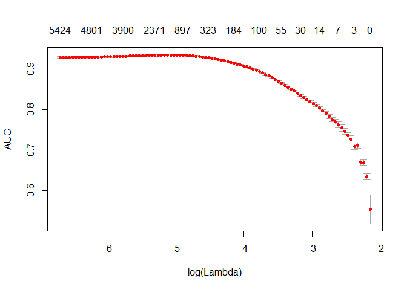

Movie Review
================
Brandon Wolff and Chih-Chin Tien
November 22, 2016

Movie Review
------------

Research Question - Can we use movie reviews to correctly predict whether the review is negative (rating &lt;/= 5 or positive (rating &gt; 7).

First we download the data.

``` r
movie_review <- read.table(file.choose(), sep="\t", quote = "", header=TRUE)
```

Split into testing and training set.

``` r
library(text2vec)
```

    ## Warning: package 'text2vec' was built under R version 3.3.2

    ## 
    ## Attaching package: 'text2vec'

    ## The following object is masked _by_ '.GlobalEnv':
    ## 
    ##     movie_review

``` r
library(data.table)
```

    ## Warning: package 'data.table' was built under R version 3.3.2

``` r
library(glmnet)
```

    ## Warning: package 'glmnet' was built under R version 3.3.2

    ## Loading required package: Matrix

    ## Warning: package 'Matrix' was built under R version 3.3.3

    ## Loading required package: foreach

    ## Loaded glmnet 2.0-5

``` r
train <- movie_review[1:12500, ]
test <- movie_review[-c(1:12500), ]
```

Creating Document Term Matrix

``` r
prep_fun = tolower 
tok_fun = word_tokenizer 
```

``` r
train_tokens = train$review %>% 
  prep_fun %>% 
  tok_fun
it_train = itoken(train_tokens, ids = train$id, progressbar = FALSE)

vocab = create_vocabulary(it_train)
vocab
```

    ## Number of docs: 12500 
    ## 0 stopwords:  ... 
    ## ngram_min = 1; ngram_max = 1 
    ## Vocabulary: 
    ##                   terms terms_counts doc_counts
    ##     1:       resolutive            1          1
    ##     2:               vt            1          1
    ##     3:         sweedish            1          1
    ##     4:       gobsmacked            1          1
    ##     5:         brubaker            1          1
    ##    ---                                         
    ## 57258:         diamonds           17         12
    ## 57259:           airman            3          3
    ## 57260:          lambast            1          1
    ## 57261: lightheartedness            1          1
    ## 57262:      unenergetic            1          1

``` r
vectorizer = vocab_vectorizer(vocab)
t1 = Sys.time()
dtm_train = create_dtm(it_train, vectorizer)
print(difftime(Sys.time(), t1, units = 'sec'))
```

    ## Time difference of 49.10746 secs

``` r
dim(dtm_train) 
```

    ## [1] 12500 57262

First Model is a logistic regression model with an L1 penalty and 4 fold cross-validation.

``` r
NFOLDS = 4
t1 = Sys.time()
glmnet_classifier = cv.glmnet(x = dtm_train, y = train[['sentiment']], family = 'binomial', alpha = 1,
                              type.measure = "auc", nfolds = NFOLDS, thresh = 1e-3, maxit = 1e3)
print(difftime(Sys.time(), t1, units = 'sec'))
```

    ## Time difference of 11.04989 secs

``` r
plot(glmnet_classifier)
```


``` r
print(paste("max AUC =", round(max(glmnet_classifier$cvm), 4)))
```

    ## [1] "max AUC = 0.9401"

``` r
it_test = test$review %>% 
  prep_fun %>% 
  tok_fun %>% 
  itoken(ids = test$id, progressbar = FALSE)

dtm_test = create_dtm(it_test, vectorizer)

dim(dtm_test) 
```

    ## [1] 12500 57262

``` r
preds = predict(glmnet_classifier, dtm_test, type = 'response')[,1]
glmnet:::auc(test$sentiment, preds)
```

    ## [1] 0.9411585

Pruning in order to make the DTM smaller and less time consuming for the model.

``` r
stop_words = c("i", "me", "my", "myself", "we", "our", "ours", "ourselves", "you", "your", "yours")
t1 = Sys.time()
vocab = create_vocabulary(it_train, stopwords = stop_words)
print(difftime(Sys.time(), t1, units = 'sec'))
```

    ## Time difference of 1.594888 secs

``` r
pruned_vocab = prune_vocabulary(vocab, term_count_min = 10, doc_proportion_max = 0.5, doc_proportion_min = 0.001)
vectorizer = vocab_vectorizer(pruned_vocab)
t1 = Sys.time()
dtm_train  = create_dtm(it_train, vectorizer)
print(difftime(Sys.time(), t1, units = 'sec'))
```

    ## Time difference of 2.264679 secs

``` r
dim(dtm_train)
```

    ## [1] 12500 10483

``` r
dtm_test   = create_dtm(it_test, vectorizer)
dim(dtm_test)
```

    ## [1] 12500 10483

Term Frequency and Inverse Document Frequency (TF-IDF) in order to Normalize DTM and give more weight to terms that are more specific and less weight for terms occurring in most reviews.

``` r
vocab = create_vocabulary(it_train)
vectorizer = vocab_vectorizer(vocab)
dtm_train = create_dtm(it_train, vectorizer)

# tfidf model
tfidf = TfIdf$new()
dtm_train_tfidf = fit_transform(dtm_train, tfidf)
dtm_test_tfidf  = create_dtm(it_test, vectorizer) %>% 
  transform(tfidf)
```

Second Model is again a logistic regression model with an L1 penalty and 4 fold cross-validation.

``` r
t1 = Sys.time()
glmnet_classifier = cv.glmnet(x = dtm_train_tfidf, y = train[['sentiment']], family = 'binomial', alpha = 1,
                              type.measure = "auc", nfolds = NFOLDS, thresh = 1e-3, maxit = 1e3)
print(difftime(Sys.time(), t1, units = 'sec'))
```

    ## Time difference of 9.828351 secs

``` r
plot(glmnet_classifier)
```



``` r
print(paste("max AUC =", round(max(glmnet_classifier$cvm), 4)))
```

    ## [1] "max AUC = 0.935"

Remember-- AUC ranges between 0.5 and 1, where 0.5 is random and 1 is perfect

``` r
preds = predict(glmnet_classifier, dtm_test_tfidf, type = 'response')[,1]
glmnet:::auc(test$sentiment, preds)
```

    ## [1] 0.9347547

The first model yields slightly more correct predictions but the second model is pruned and therefore faster to run.
