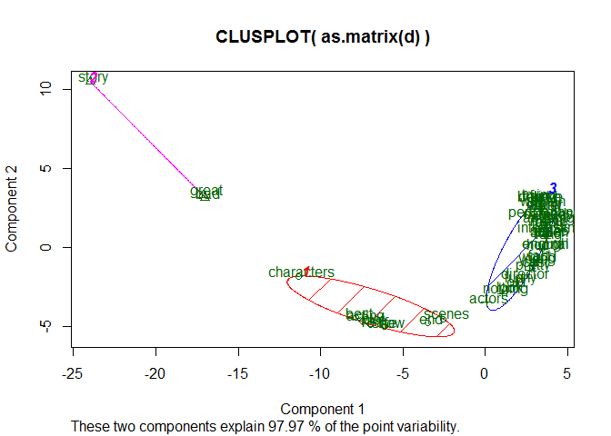

Word Cluster
================
Brandon Wolff and Chih-Chin Tien
December 1, 2016

K-means Clustering
------------------

Using K- means to explore the data and see potential groupings.

``` r
library(tm)
```

    ## Warning: package 'tm' was built under R version 3.3.2

    ## Loading required package: NLP

    ## Warning: package 'NLP' was built under R version 3.3.2

``` r
docs <- Corpus(DirSource("wordstrain"))

mystopwords=c("i'm","'re",'but','many','and',"can",'good','know','ll','will','one','now',"re","ve","don't","get","well","back","let's","dont","tell","every","yes","everyone","right","much","anyone","lets","just","ever","isn't","still","let","said","ago","right","see","couldn't","wanted","even","tonight","things","others","going","like","way","make","also","applause","years","small","big","want","new","first","state","better","day","must","put","next","longer","never","come","made","time","guy","real","really","got","movie","film","watching","something","actually","another","man","movies","littl","use","give","find","thing","work","movi","onli","very","films","think","character","scene","isnt","doesnt","thats","around","cant","didnt","lot","might","theres","take","say","quite","may","however","though","watch","seen","gets","without","almost","wasnt","making","seems","yet","ive","seems","bit","thought","saw","last","played","done","makes","plays","kind","part","whole","later","hes","although","sure","always","times","since","probably","far","feel","little", "two", "people")

docs <- tm_map(docs, removePunctuation)

for(j in seq(docs))   
   {   
     docs[[j]] <- gsub("/", " ", docs[[j]])   
     docs[[j]] <- gsub("@", " ", docs[[j]])   
     docs[[j]] <- gsub("\\|", " ", docs[[j]])   
}   

docs <- tm_map(docs, removeNumbers) 

docs <- tm_map(docs, tolower)

docs <- tm_map(docs,removeWords,c(stopwords("en"),mystopwords)) 
```

``` r
 library(SnowballC)   
```

    ## Warning: package 'SnowballC' was built under R version 3.3.2

``` r
docs <- tm_map(docs, stemDocument)   

docs <- tm_map(docs, stripWhitespace)

docs <- tm_map(docs, PlainTextDocument)
```

``` r
dtm <- DocumentTermMatrix(docs)   
dtm
```

    ## <<DocumentTermMatrix (documents: 1, terms: 82430)>>
    ## Non-/sparse entries: 82430/0
    ## Sparsity           : 0%
    ## Maximal term length: 64
    ## Weighting          : term frequency (tf)

``` r
tdm <- TermDocumentMatrix(docs)   
tdm
```

    ## <<TermDocumentMatrix (terms: 82430, documents: 1)>>
    ## Non-/sparse entries: 82430/0
    ## Sparsity           : 0%
    ## Maximal term length: 64
    ## Weighting          : term frequency (tf)

``` r
dtms <- removeSparseTerms(dtm, 0.1) 
```

``` r
freq <- sort(colSums(as.matrix(dtms)), decreasing=TRUE)   
head(freq, 14)
```

    ##      story      great        bad characters       best     acting 
    ##       5540       4468       4448       3648       3181       3128 
    ##       love       plot       life       show        end     scenes 
    ##       3070       3067       2968       2960       2660       2546 
    ##     actors    nothing 
    ##       2229       2107

``` r
freq50 <- findFreqTerms(dtm, lowfreq=50)
```

``` r
wf <- data.frame(word=names(freq), freq=freq)   
head(wf)
```

    ##                  word freq
    ## story           story 5540
    ## great           great 4468
    ## bad               bad 4448
    ## characters characters 3648
    ## best             best 3181
    ## acting         acting 3128

``` r
View(wf)
```

``` r
tdm <- tdm[names(tail(sort(rowSums(as.matrix(tdm))), 50)), ]
tdm
```

    ## <<TermDocumentMatrix (terms: 50, documents: 1)>>
    ## Non-/sparse entries: 50/0
    ## Sparsity           : 0%
    ## Maximal term length: 11
    ## Weighting          : term frequency (tf)

``` r
dtm <- dtm[, names(tail(sort(colSums(as.matrix(dtm))), 50))]
inspect(dtm)
```

    ## <<DocumentTermMatrix (documents: 1, terms: 50)>>
    ## Non-/sparse entries: 50/0
    ## Sparsity           : 0%
    ## Maximal term length: 11
    ## Weighting          : term frequency (tf)
    ## 
    ##               Terms
    ## Docs            fun trying believe found girl course woman rather worst
    ##   character(0) 1244   1248    1249  1251 1257   1259  1301   1323  1331
    ##               Terms
    ## Docs           away performance minutes comedy script anything music
    ##   character(0) 1341        1394    1398   1412   1434     1440  1460
    ##               Terms
    ## Docs           family least interesting series role action point long
    ##   character(0)   1479  1509        1518   1533 1545   1550  1552 1571
    ##               Terms
    ## Docs           horror original enough fact world young cast pretty
    ##   character(0)   1655     1655   1659 1747  1755  1795 1807   1845
    ##               Terms
    ## Docs           director funny  old look nothing actors scenes  end show
    ##   character(0)     1923  1969 2009 2067    2107   2229   2546 2660 2960
    ##               Terms
    ## Docs           life plot love acting best characters  bad great story
    ##   character(0) 2968 3067 3070   3128 3181       3648 4448  4468  5540

``` r
dtmss <- removeSparseTerms(dtm, 0.15)    
```

``` r
library(cluster)   
library(fpc)   
```

    ## Warning: package 'fpc' was built under R version 3.3.2

``` r
d <- dist(t(dtmss), method="euclidian")   
kfit <- kmeans(d, 3)   
clusplot(as.matrix(d), kfit$cluster, color=T, shade=T, labels=2, lines=0)     
```


